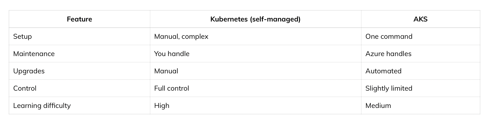
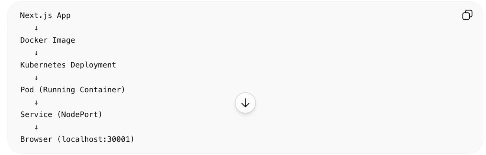
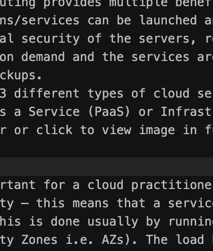
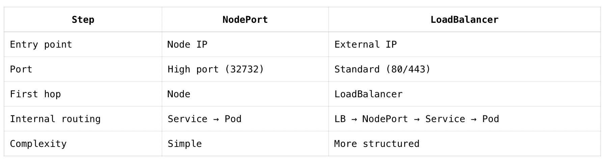
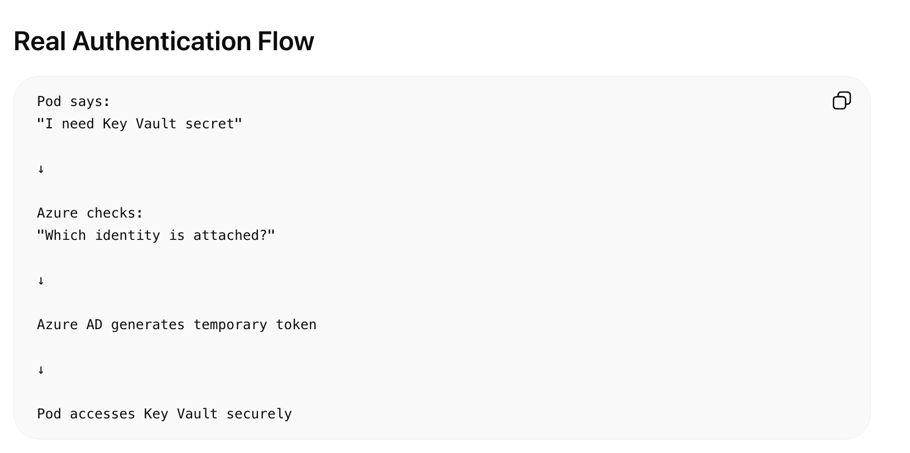

# **Azure Kubernetes Service**

AKS stands for Azure Kubernetes Service.

🔷 Simple definition

👉 AKS is a managed Kubernetes service in Microsoft Azure that lets you run and scale containerized applications.

🔷 Break it down (very simply)

Docker → builds your app as an image
ACR → stores that image
AKS → runs that image as a live application

🔷 What AKS actually does
AKS manages:

Running containers
Scaling (more users → more containers)
Load balancing (distribute traffic)
Self-healing (restart failed containers)

🔷 Real-world flow

Your Code
   ↓
Docker Image
   ↓
ACR (storage)
   ↓
AKS (runs containers)
   ↓
Users access your app
🔷 Example (your case)

You built:

React + Spring Boot app
Docker image
Pushed to ACR

👉 AKS will:
pull that image
run it in containers
expose it via public IP

🔷 Core Kubernetes concepts (used in AKS)

You’ll work with:
Pod → smallest unit (runs container)
Deployment → manages pods
Service → exposes app to internet

🔷 Why use AKS?

Use AKS when you need:
High scalability
Microservices architecture
Production-grade deployments
Auto-healing systems

🔷 When NOT to use AKS

Don’t use AKS if:
You just want to deploy quickly
Small app / learning stage
👉 Use simpler options like:

👉 AKS = a system that runs and manages your Docker containers at scale using Kubernetes

## Relation between AKS and Kubernetes in general:

👉 Azure Kubernetes Service = managed version of Kubernetes

👉 Kubernetes = the actual open-source system

🔷 What is “Kubernetes in general”?

Kubernetes (often called K8s) is:

An open-source system
Used to run and manage containers
Handles scaling, networking, self-healing
Normally, you would:

install Kubernetes yourself
manage servers (nodes)
handle upgrades, security, networking
👉 That’s a lot of work.

🔷 What AKS does differently

With AKS in Microsoft Azure:

Azure manages the control plane (master nodes)
You only manage:
applications
deployments
scaling configs

🔷 Side-by-side comparison

🔷 What remains the SAME

Whether it’s AKS or raw Kubernetes, you still use:

Pods
Deployments
Services
YAML files
kubectl commands

🔷 What changes in AKS

You don’t worry about:

cluster setup
master node failures
low-level networking

🔷 What AKS actually is

Azure Kubernetes Service =
👉 A service in Azure that lets you create and manage Kubernetes clusters

So:
AKS = the service
Cluster = the thing you create inside it

Azure (cloud)
↓
AKS (service)
↓
Cluster(s)
↓
Nodes (VMs)
↓
Pods (containers)

## To Create a AKS:
az aks create \
  --resource-group acr-learning-rg \
  --name ankitvAKSCluster \
  --node-count 1 \
  --node-vm-size Standard_dc16ads_cc_v5 \
  --enable-managed-identity \
  --generate-ssh-keys

## Right Now Kubernetes is set up locally

Installed Minikube
Started cluster
Connected kubectl
Cluster → Running locally

Deployed app to Kubernetes

Created Deployment YAML
Created Service YAML

✔ Your app is now running inside Kubernetes Pods

🟢 Exposed app to browser

NodePort service created
App accessible via localhost:30001
Docker → Pod → Service → Browser

👉 No single command is “running your app”

Your app is running because of this:

kubectl apply -f deployment.yaml

🔍 What actually happens behind the scenes

When you ran:

kubectl apply -f deployment.yaml

Kubernetes:
Reads your YAML
Creates a Deployment
Deployment creates Pods
Pods run your container (your app)

👉 So Deployment = the thing that runs your app

🚀 Then what does service do?

When you ran:
kubectl apply -f service.yaml

👉 This does NOT run your app

It only:
exposes your app
gives network access
⚡ And this command?

minikube service health-monitoring-frontend-service
👉 This also does NOT start your app

It just:
opens a URL to access it
🧩 Simple analogy
Deployment → “Run my app”
Pod → “App instance”
Service → “Make app reachable”
minikube service → “Open the door”

## All command Used to run React app with Minikube:
1. Start Docker Desktop
Needed because Minikube uses Docker driver.

Verify:
docker ps

2. Start Minikube Cluster
minikube start

3. Verify Kubernetes Cluster
kubectl get nodes

4. Build Docker Image
docker build -t health-monitoring-frontend:latest .

5. Login to Azure
az login

6. Login to ACR
az acr login --name ankitv132acr

7. Tag Image for ACR
docker tag health-monitoring-frontend:latest \
ankitv132acr.azurecr.io/health-monitoring-frontend:latest

8. Push Image to ACR
docker push \
ankitv132acr.azurecr.io/health-monitoring-frontend:latest

9. Deploy Application to Kubernetes
kubectl apply -f k8s/non-prod/deployment.yaml

10. Deploy Service
kubectl apply -f k8s/non-prod/service.yaml

11. Verify Pods
kubectl get pods --all-namespaces

Or namespace-specific:
kubectl get pods -n health-app-dev

12. Verify Services
kubectl get svc -n health-app-dev

13. Open App in Browser
minikube service health-monitoring-frontend-service \
-n health-app-dev

At first glance both NodePort and LoadBalancer give you an IP, so they feel the same. But they are not the same layer.

🧠 Core difference (simple)

NodePort = expose via node’s IP + high port
LoadBalancer = expose via external IP (and uses NodePort underneath)

🔍 Your current case (Minikube)

You saw:

NodePort:      192.168.x.x:32732
LoadBalancer:  127.0.0.1:80 (via tunnel)

👉 Both work, but how they work is different.

🧩 NodePort
How it works:
Browser → Node IP:NodePort → Service → Pod

Example:

http://192.168.49.2:32732

Key points:
Uses node’s IP
Uses random high port (30000–32767)
Simple, direct
Not very user-friendly (ugly URL)

🧩 LoadBalancer
How it works:
Browser → External IP → LoadBalancer → NodePort → Pod
👉 Yes, internally it still uses NodePort

Example:
http://127.0.0.1:80

Key points:
Gives clean IP + port 80
Simulates real cloud load balancer

Needs:
minikube tunnel

## Let’s compare NodePort vs LoadBalancer purely from request flow (browser → container).

🧠 1. NodePort – Request Flow

Browser
   ↓
Node IP : NodePort (e.g. 192.168.49.2:32732)
   ↓
Kubernetes Node (kube-proxy)
   ↓
Service (NodePort)
   ↓
Pod
   ↓
Container (your app)

🔑 Key idea:
You directly hit the node machine
Using a high port (30000–32767)

Example:
http://192.168.49.2:32732

🧠 2. LoadBalancer – Request Flow
Browser
   ↓
External IP (e.g. 127.0.0.1 or cloud IP)
   ↓
LoadBalancer
   ↓
NodePort (internally)
   ↓
Service
   ↓
Pod
   ↓
Container

🔑 Key idea:
You hit a stable external entry point

LoadBalancer forwards traffic to NodePort internally
Example:
http://127.0.0.1

## What kube-proxy actually does

When a Service is created:

kind: Service
type: NodePort

kube-proxy configures:

"If traffic comes to this port,
forward it to matching pods"

using:
iptables
OR
IPVS

Real Internal Flow
Browser
   ↓
NodePort (32732)
   ↓
iptables rules (managed by kube-proxy)
   ↓
Service
   ↓
Selected Pod

## ⚡ Side-by-side comparison

🔥 Visual difference (very clear)

NodePort
Browser
   ↓
Node:Port ───────────────► Pod

LoadBalancer
Browser
   ↓
LoadBalancer
   ↓
Node:Port
   ↓
Pod

🧠 Important insight

👉 LoadBalancer actually USES NodePort underneath
You saw this:

NodePort: 32732
👉 Even with LoadBalancer, that still exists

1. Managed Kubernetes Concept 🔥

Biggest AKS idea.

In self-managed Kubernetes, YOU manage:

control plane
upgrades
etcd
HA
patches

In AKS:

Microsoft manages Control Plane
You manage Worker Nodes + Applications

This is the core AKS value proposition.

2. Shared Responsibility Model 🔥

Very important cloud concept.

Azure manages:
control plane
API server
etcd
scheduler
availability of masters
You manage:
node pools
workloads
security configs
networking
scaling rules
app deployments
3. Node Pools Theory 🔥

AKS separates workloads using node pools.

Example:

System Node Pool
   → Kubernetes system pods

User Node Pool
   → Your applications

GPU Node Pool
   → AI/ML workloads

Important architect topic.

4. AKS + ACR Integration 🔥

Core Azure architecture.

AKS pulls images from ACR

Usually through:

managed identity
RBAC permissions

Flow:

Code
 ↓
Docker Image
 ↓
ACR
 ↓
AKS pulls image
 ↓
Pods run
5. Managed Identity Theory 🔥

Huge Azure topic.

Instead of storing secrets/passwords:

AKS Pod
   ↓
Managed Identity
   ↓
Access Azure Resources Securely

Used for:

Key Vault
Storage Accounts
Service Bus
Cosmos DB

6. Ingress vs Azure Application Gateway 🔥
In production:

NGINX Ingress
OR
Azure Application Gateway Ingress Controller (AGIC)

Flow:

Internet
   ↓
Azure Application Gateway
   ↓
AKS Ingress
   ↓
Services
   ↓
Pods

7. Autoscaling Theory 🔥
AKS supports:

Pod Autoscaling
More traffic
   ↓
More Pods
Cluster Autoscaling
More pods cannot fit
   ↓
Add more VMs/nodes

This is a BIG cloud-native advantage.

## How aks access key vault secrets?
There are multiple ways, but modern AKS usually accesses Azure Key Vault using:

Managed Identity + CSI Driver

This is the preferred enterprise approach.

**High-Level Flow**
Pod in AKS
   ↓
Managed Identity
   ↓
Azure AD validates identity
   ↓
Access Key Vault
   ↓
Secrets fetched securely

No passwords stored inside app.

Problem This Solves

Without Key Vault:

password: my-secret-password

inside YAML/env vars ❌

Bad because:

secrets exposed
rotation hard
security risk
AKS Secure Approach

Instead:

Application asks Key Vault dynamically

using Azure identity.

Core Components
1. Managed Identity 🔥

AKS or pod gets Azure identity automatically.

Think:

VM/Pod gets its own Azure identity card

No username/password needed.

2. Azure AD

Authenticates identity.

Checks:

"Is this AKS pod allowed to access Key Vault?"
3. Key Vault Access Policies / RBAC

Defines permissions like:

Can read secrets
Can read certificates
Cannot delete
4. CSI Driver 🔥

Very important component.

Full name:

Secrets Store CSI Driver

It mounts Key Vault secrets into pod filesystem.

**Real Architecture**
Pod
 ↓
CSI Driver
 ↓
Managed Identity
 ↓
Azure AD
 ↓
Azure Key Vault
 ↓
Secrets returned
How App Gets Secret

Two common ways.

Option 1. Mounted as File (most common)

Example inside pod:

/mnt/secrets/db-password

Application reads file.

Option 2. Synced as Kubernetes Secret

Key Vault secret becomes:

kind: Secret
inside Kubernetes.

Then app uses env vars.

Example Flow
Suppose:

Secret in Key Vault:
db-password = SuperSecret123

Pod starts.

CSI driver:

authenticates
fetches secret
mounts into container

Application reads:

/mnt/secrets/db-password
Why Managed Identity is Powerful 🔥

Without managed identity:

Store credentials to access Key Vault

Problem:

credential rotation
leakage risk
maintenance

With Managed Identity:

Azure handles authentication automatically

Much safer.

## What is Managed Identity?

Managed Identity is an identity automatically created in Azure AD for a resource.

Example resources:

Azure Kubernetes Service
VM
App Service
Function App

Think:

Azure Resource
   ↓
Gets Azure AD Identity

like a service account for cloud resources.

How Identity Gets Assigned

2 ways.

1. System Assigned Managed Identity 🔥

Identity attached directly to resource.

Example:

AKS Cluster
   ↓
Enable Managed Identity
   ↓
Azure creates identity automatically

Lifecycle:

Delete AKS
   ↓
Identity also deleted
Example

When creating AKS:

az aks create --enable-managed-identity

Azure:

creates identity in Azure AD
links it to AKS
Behind the scenes

Azure generates:

Principal ID
Client ID
Tenant ID

for the resource.

2. User Assigned Managed Identity 🔥

Separate reusable identity resource.

Example:

Identity Resource
   ↓
Attached to:
  - AKS
  - VM
  - App Service

Useful when multiple services need same permissions.

Architecture Difference
System Assigned
AKS Cluster
   ↓
Own identity
User Assigned
Shared Identity
   ├── AKS
   ├── VM
   └── App Service

## How AKS Pod Actually Uses It

This is important.

The pod itself does NOT magically know Azure credentials.

Usually:

Pod
 ↓
Workload Identity / Pod Identity
 ↓
Managed Identity
 ↓
Azure AD Token
 ↓
Access Azure Service

Azure issues OAuth token dynamically.

## Managed Identity itself does NOT automatically get Key Vault access.You must explicitly grant permissions to that identity.

Flow:

AKS/Pod gets Managed Identity
   ↓
Identity exists in Azure AD
   ↓
You grant that identity access to Key Vault
   ↓
Now AKS can read secrets

Step-by-Step Flow
1. AKS Gets Managed Identity

When creating AKS:

az aks create --enable-managed-identity

Azure creates:

Managed Identity
for the cluster.

2. Find Identity Details

Example:

az aks show \
  --resource-group my-rg \
  --name my-aks \
  --query identity

You’ll get something like:

{
  "principalId": "xxxxx",
  "tenantId": "xxxxx"
}

Important one:
principalId

This uniquely identifies AKS identity in Azure AD.

3. Grant Key Vault Permissions 🔥

Now you tell Key Vault:

"This identity can read secrets"

Using Azure RBAC.

Example:

az role assignment create \
  --role "Key Vault Secrets User" \
  --assignee <principal-id> \
  --scope <key-vault-resource-id>
What happens internally?

Azure stores mapping like:

Managed Identity
   ↓
Allowed Role:
Key Vault Secrets User
   ↓
Scope:
Specific Key Vault
4. Pod Requests Secret

Now pod says:

"I need secret from Key Vault"

Azure:

verifies managed identity
checks RBAC permissions
issues access token

If allowed:

✅ Secret returned

Real Authentication Flow
Pod
 ↓
Managed Identity
 ↓
Azure AD Token
 ↓
Key Vault RBAC Check
 ↓
Secret Access Granted

For modern Azure Kubernetes Service clusters, Managed Identity is typically created automatically or enabled by default depending on how AKS is created.

So effectively:

Create AKS
   ↓
AKS gets Managed Identity

Flow:
AKS gets Managed Identity
   ↓
Managed Identity gets permission on Key Vault
   ↓
Pods/Workloads use that identity
   ↓
Secrets accessed securely