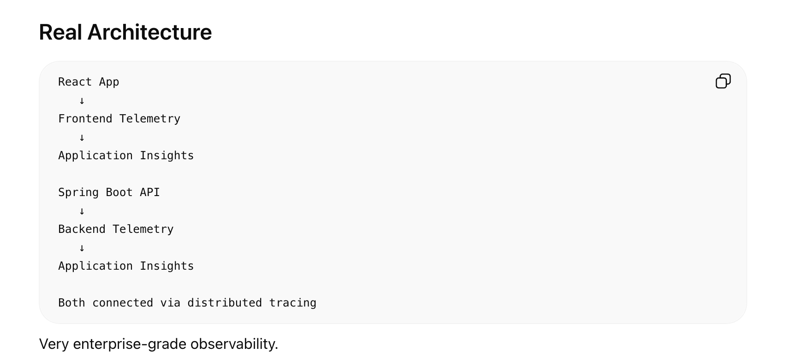
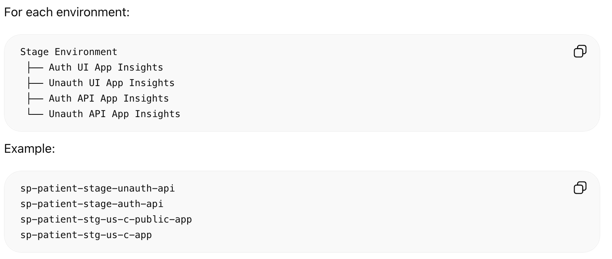

# **Application Insight**

What is Application Insights?

Application Insights (App Insights) is:

monitoring
logging
telemetry
performance tracking

Azure Application Insights is an actual Azure resource.

Just like:

Storage Account
Key Vault
AKS
App Service

you create an Application Insights resource inside Microsoft Azure.

Architecture
Your Application
   ↓
Telemetry SDK / Agent
   ↓
Application Insights Resource
   ↓
Stores telemetry data

What It Can Track
Requests

Example:

GET /api/users
Response time: 120ms
Status: 200
Failures
500 Internal Server Error
NullPointerException

Dependency Calls

Tracks calls to:

DB
Redis
external APIs
Service Bus

Example:

SQL query took 3s

Distributed Tracing 🔥

Very important in microservices.

Example:

Frontend
   ↓
API Gateway
   ↓
User Service
   ↓
Database

App Insights traces full request journey.

Live Metrics

Real-time:

CPU
requests/sec
failures
memory

Big Architecture Picture
Application
   ↓
Telemetry SDK
   ↓
Application Insights
   ↓
Azure Monitor
   ↓
Dashboards / Alerts / Logs

Important Word: Telemetry 🔥

Telemetry means:

Operational data sent by application

Examples:

logs
metrics
traces
exceptions

Core Concepts
1. Logs

Text events.

Example:

User login failed
2. Metrics

Numerical values over time.

Example:

CPU = 80%
Response time = 200ms
3. Traces 🔥

Request journey across systems.

Very important in distributed systems.

4. Exceptions

Tracks errors automatically.

Example:

NullPointerException
TimeoutException
5. Dependency Tracking

Tracks external calls.

Example:

API → SQL DB
API → Redis
API → External Payment API

How App Sends Data

Usually via SDK.

Examples:

Java SDK
Node.js SDK
.NET SDK

Application sends telemetry automatically.

Example Java/Spring Boot

Dependency:

applicationinsights-spring-boot-starter

Then telemetry auto-collected.

## KQL (Kusto Query Language) 🔥🔥🔥

Huge Azure monitoring skill.

Used to query logs.

Example:

requests
| where success == false

Real Production Flow
User Request
   ↓
Application
   ↓
Telemetry Generated
   ↓
Application Insights
   ↓
Dashboards / Alerts / Analytics

## For a Java Spring Boot app, enabling Azure Application Insights is actually pretty simple now.

Modern approach is usually:

Spring Boot App
   ↓
Application Insights Java Agent
   ↓
Telemetry automatically collected

You usually do NOT need heavy code changes.

Step 1. Create Application Insights Resource

In Microsoft Azure Portal:

Create Resource
   ↓
Application Insights

Choose:

workspace-based (recommended)
region
resource group
Step 2. Get Connection String

Go:

Application Insights
   ↓
Overview
   ↓
Connection String

Looks like:

InstrumentationKey=...
IngestionEndpoint=...
Step 3. Download Java Agent

From Microsoft docs/GitHub.

Usually file:

applicationinsights-agent-3.x.jar
Step 4. Run Spring Boot App with Agent

Example:

java \
-javaagent:applicationinsights-agent-3.7.5.jar \
-Dapplicationinsights.connection.string="YOUR_CONNECTION_STRING" \
-jar app.jar

That’s it 🔥

Telemetry starts flowing automatically.

## Telemetry SDK is basically:

A library/agent that collects monitoring data from your application and sends it to a monitoring system like Azure Application Insights.

Think:

Application
   ↓
Telemetry SDK
   ↓
Monitoring Platform

## For React / Next.js apps, Azure Application Insights integration is usually done using the JavaScript SDK.

Frontend telemetry is slightly different from backend telemetry.

Frontend focuses more on:

page views
user actions
browser errors
frontend performance
API call timings

Big Picture Architecture
Browser
   ↓
React / Next.js App
   ↓
Application Insights JS SDK
   ↓
Azure Application Insights

React / Next.js Setup
Step 1. Install SDK
npm install @microsoft/applicationinsights-web

Usually also:

npm install @microsoft/applicationinsights-react-js

for React integration.

Step 2. Create App Insights Config

Example:

import { ApplicationInsights } from "@microsoft/applicationinsights-web";

const appInsights = new ApplicationInsights({
  config: {
    connectionString: process.env.NEXT_PUBLIC_APPINSIGHTS_CONNECTION_STRING,
    enableAutoRouteTracking: true
  }
});

appInsights.loadAppInsights();

export default appInsights;
Step 3. Initialize App Insights

In Next.js:

Usually:

_app.tsx
app layout
client entry point

Step 4. Add Environment Variable

.env.local

NEXT_PUBLIC_APPINSIGHTS_CONNECTION_STRING=xxxx

Important:

NEXT_PUBLIC_

because frontend env vars are exposed to browser.

## Create Application Insights from Azure Portal
Step 1. Open Azure Portal

Go to:

Azure Portal

Step 2. Create Resource

Search:

Application Insights

Then click:

Create
Step 3. Fill Basic Details

You’ll see fields like:

Field	What to Select
Subscription	Your Azure subscription
Resource Group	Existing or create new
Name	Example: health-monitoring-appinsights
Region	Same as your app ideally
Resource Mode	Workspace-based (recommended)

Most Important Thing After Creation 🔥

Get:

Connection String

Path:

Application Insights
   ↓
Overview
   ↓
Connection String

Looks like:

InstrumentationKey=...
IngestionEndpoint=...

Your application uses this to send telemetry.

## You can use the same Azure Application Insights connection string for:

frontend
backend
microservices

and many teams do that initially.

But architecturally, there are tradeoffs.

Option 1. Single App Insights Resource 🔥

Example:

Frontend
Backend
Worker Service
   ↓
Same App Insights Resource
Advantages

✅ Easier setup
✅ End-to-end tracing works nicely
✅ Single dashboard
✅ Easier correlation between services
✅ Simpler for small projects

Disadvantages

❌ Logs become noisy
❌ Harder to isolate environments/services
❌ Telemetry volume grows huge
❌ Permissions separation harder
❌ Difficult cost management

Option 2. Separate App Insights per Service

Example:

frontend-appinsights
backend-appinsights
worker-appinsights
Advantages

✅ Better isolation
✅ Cleaner observability
✅ Easier ownership by teams
✅ Better RBAC/security
✅ Better cost visibility

Disadvantages

❌ Slightly more setup
❌ Cross-service tracing more complex

Most Common Real-World Pattern 🔥

Usually companies do:

One App Insights per environment/application boundary

Example:

health-app-dev-ai
health-app-prod-ai

Inside same app insight:

frontend
backend
APIs

are often combined.

Why Same Resource Helps Initially

Then App Insights can correlate:

Frontend request
   ↓
Backend API call
   ↓
DB query

inside one trace.

Very cool and useful.

Enterprise Scaling Pattern

As systems grow:

Frontend AI
Backend AI
Platform AI
Shared Log Analytics Workspace

More mature observability architecture.

## Our Real Project architecture:

In our Specialty Project, Azure Application Insights resources are organized separately for the UI and Backend layers. Each environment such as Production, Stage, Test, and Performance has its own dedicated Application Insights setup to ensure telemetry isolation and environment-specific monitoring.

Within a particular environment, Application Insights is further separated based on application type and security boundary. The application consists of:

two UI applications: Auth UI and Unauth/Public UI
two backend APIs: Auth API and Unauth API

Each of these components has its own dedicated Application Insights resource for cleaner observability, better monitoring, easier troubleshooting, and separate alerting.

Example resources in the Stage environment:

sp-patient-stage-auth-api
sp-patient-stage-unauth-api
sp-patient-stg-us-c-app
sp-patient-stg-us-c-public-app
Example:
sp-patient-stage-unauth-api
sp-patient-stage-auth-api
sp-patient-stg-us-c-public-app
sp-patient-stg-us-c-app

Observability Architecture View
Frontend Applications
   ↓
Frontend Application Insights

Backend Services
   ↓
Backend Application Insights

All Telemetry
   ↓
Azure Monitor / Log Analytics Workspace

Stage Environment Example
Stage Environment
│
├── UI Layer
│   ├── Public / Unauth UI
│   │     └── sp-patient-stg-us-c-public-app
│   │
│   └── Authenticated UI
│         └── sp-patient-stg-us-c-app
│
└── Backend Layer
    ├── Unauth API
    │     └── sp-patient-stage-unauth-api
    │
    └── Auth API
          └── sp-patient-stage-auth-api

High-Level Relationship Diagram

                    Users
                      │
         ┌────────────┴────────────┐
         │                         │
         ▼                         ▼
   Public / Unauth UI         Authenticated UI
         │                         │
         │                         │
         ▼                         ▼
sp-patient-stg-us-c-public-app   sp-patient-stg-us-c-app
         │                         │
         └────────────┬────────────┘
                      │
                      ▼
                Backend APIs
         ┌────────────┴────────────┐
         │                         │
         ▼                         ▼
  Unauth Backend API         Auth Backend API
         │                         │
         ▼                         ▼
sp-patient-stage-unauth-api  sp-patient-stage-auth-api

## Distributed Tracing:

When one request travels through multiple systems:

User Request
   ↓
Backend API
   ↓
External API
   ↓
Database

Application Insights tries to track the ENTIRE journey as one trace.

Core Building Blocks
Term	Meaning
Trace	Complete request journey
Span	One operation inside trace
Correlation ID	Unique request identifier
Dependency	External call (DB/API/etc.)
Example Flow

Suppose:

GET /patients

hits your Spring Boot API.

Inside API:

DB query executed
External insurance API called
What Happens Internally 🔥
Request comes in
   ↓
Telemetry SDK intercepts request
   ↓
Creates Trace ID

Example:

trace-id = abc123

This trace ID follows the whole request.

Step 1. Incoming API Request Logged

SDK automatically creates:

Request Telemetry

Example:

GET /patients
Duration: 2.1s
Status: 200
TraceId: abc123
Step 2. Database Call Happens 🔥

Suppose code executes:

patientRepository.findAll()

Telemetry SDK hooks into:

JDBC
Hibernate
datasource drivers

automatically.

It creates:

Dependency Telemetry

Example:

Dependency Type: SQL
Query Duration: 300ms
TraceId: abc123
Step 3. External API Call Happens 🔥

Suppose:

restTemplate.getForObject(...)

SDK intercepts:

RestTemplate
WebClient
OkHttp
HttpClient

and logs dependency.

Example:

Dependency Type: HTTP
Target: insurance-api.com
Duration: 1.2s
TraceId: abc123
Key Magic 🔥🔥🔥

All telemetry shares SAME trace ID.

So App Insights reconstructs:

GET /patients
   ├── SQL Query
   └── External Insurance API Call

as one transaction.

Final Visualization in App Insights

You’ll see:

Request: GET /patients
  ├── SQL Dependency
  ├── Redis Dependency
  └── External API Dependency

with timings.

Very powerful for debugging.

How SDK Captures It Automatically

Telemetry SDK instruments frameworks/libraries.

Examples:

Operation	    SDK Hooks Into
Incoming HTTP	Spring MVC / Servlet
SQL	            JDBC/Hibernate
REST Calls	    RestTemplate/WebClient
Exceptions	    JVM exception handling

Trace vs Span
Trace

Entire request journey.

Example:

User Request → API → DB → External API
Span

One operation.

Example spans:

incoming API request
SQL query
external API call
Example Structure
Trace: abc123
   ├── Span: GET /patients
   ├── Span: SQL query
   └── Span: Insurance API call
What About Microservices? 🔥🔥🔥

Suppose:

Frontend
 ↓
Patient API
 ↓
Insurance API
 ↓
Payment API

**Trace ID propagates via HTTP headers.**

Usually:

traceparent

header.

Each service continues same trace.

## Trace Id & Correlation Id:
These two terms are closely related and often used together in observability/distributed tracing systems like Azure Application Insights.

But there is a subtle difference.

Simple Understanding
Term	Purpose
Trace ID	Tracks entire request journey
Correlation ID	Links related operations/logs together
1. Trace ID 🔥

Trace ID identifies:

One complete distributed request flow

Example:

Frontend
 ↓
Backend API
 ↓
DB
 ↓
External API

All operations share SAME trace ID.

Example
TraceId = abc123

This trace ID appears on:

API request
DB query
external API call
downstream microservices
Think of Trace ID as
Tracking number for one request
Example Structure
Trace: abc123
   ├── GET /patients
   ├── SQL Query
   └── Insurance API Call

Everything belongs to same trace.

2. Correlation ID 🔥

Correlation ID is broader.

It links:

logs
requests
services
operations

that are related.

Example

Suppose:

User clicks Checkout

Many things happen:

frontend event
payment API
inventory API
notification service

Correlation ID helps associate all related activities.

Think of Correlation ID as
Conversation identifier

across systems/logs.

Important Difference
Trace ID

Strictly part of distributed tracing model.

Used for:

spans
traces
telemetry correlation
Correlation ID

More generic/business-level linking.

Can correlate:

logs
transactions
workflows
async jobs

even outside tracing systems.

## Yes — correlation/distributed tracing can STILL work even if UI and Backend use different Azure Application Insights resources. 🔥

This is actually common in enterprise setups like yours.

Important Idea

Correlation works because of:

Trace Context Propagation

NOT because both apps use same App Insights resource.

What Actually Connects Requests

The real connector is:

Trace ID / Correlation Headers

passed between systems.

Usually headers like:

traceparent
tracestate
request-id
Your Architecture
UI App
   ↓
UI App Insights

Backend API
   ↓
Backend App Insights

Even though App Insights resources are separate:

Browser request
   ↓
Trace headers added
   ↓
Backend receives same trace context

So correlation still works.

Real Flow
Step 1 — User Opens UI

Frontend SDK creates:

TraceId = abc123
Step 2 — UI Calls Backend API

Frontend automatically sends headers:

traceparent: abc123
Step 3 — Backend Receives Request

Backend SDK sees:

Incoming traceparent header

Instead of creating new trace:

it CONTINUES same trace.
Step 4 — Backend Logs Dependencies

Now backend traces:

SQL
external APIs
Redis

using same trace context.

Final Result

Even across separate App Insights resources:

Frontend Request
   ↓
Backend API
   ↓
DB Query

remain correlated.

Important Enterprise Reality 🔥

Many companies intentionally separate:

frontend App Insights
backend App Insights

for:

RBAC
cost
noise isolation
operational ownership

Yet tracing still works.

This Is Why Log Analytics Workspace Matters 🔥

Often architecture becomes:

Frontend App Insights
Backend App Insights
Worker App Insights
        ↓
Shared Log Analytics Workspace

Then KQL can correlate telemetry across resources.

## Operation Id:
Operation Id in Azure Application Insights is basically:

The identifier used to group all telemetry belonging to one end-to-end request/operation.

In practice:

Operation Id ≈ Trace Id

in modern distributed tracing systems.

Simple Understanding

Suppose:

User opens patient dashboard

This triggers:

UI Request
 ↓
Backend API
 ↓
SQL Query
 ↓
External Insurance API

All telemetry generated during this flow shares SAME:

Operation Id

Example:

operation_Id = abc123
Why It Exists

Application Insights needs a way to say:

"These logs/traces/dependencies belong together"

Operation Id provides that grouping.

Example Telemetry
Telemetry Type	Operation Id
GET     /patients	abc123
SQL     Query	abc123
External API Call	abc123
Exception	    abc123

Result
App Insights reconstructs:
One complete transaction
from separate telemetry events.

Important Relationship
Concept	Meaning
Operation Id	Entire request/transaction identifier
Span Id / Parent Id	Individual operation identifier
Trace	Collection of spans

Example Structure
OperationId: abc123
   ├── Request: GET /patients
   ├── Dependency: SQL Query
   ├── Dependency: Redis
   └── Dependency: External API

In Modern Terms 🔥

Historically App Insights used:

Operation Id

Modern distributed tracing/OpenTelemetry uses:

Trace Id

**Nowadays they are conceptually almost same.**

The confusing part is:
In modern systems, Operation Id and Trace Id are often effectively the SAME thing.

