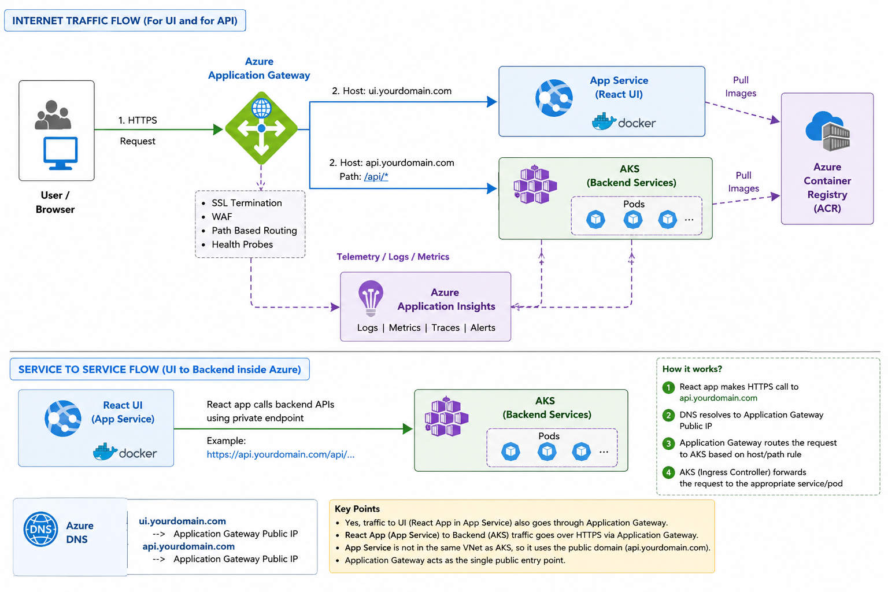

# **Azure Application Gateway**

## 🧠 What is Application Gateway?

It is:
Layer 7 Load Balancer
for HTTP/HTTPS traffic.

🚀 Main job
It sits in front of your applications and handles:

Internet Traffic
      ↓
Application Gateway
      ↓
Backend Apps

🔥 Why not normal Load Balancer?
Because Azure Load Balancer works at:
Layer 4 (TCP/UDP)

Application Gateway works at:
Layer 7 (HTTP/HTTPS)

So it understands:
URLs
paths
domains
cookies
headers

🧠 Real example
Suppose:

api.health.com/auth
api.health.com/survey
api.health.com/reports

Application Gateway can route:
Path	   Backend
/auth	   auth-service
/survey	survey-service
/reports	report-service

🚀 Architecture
Users
   ↓
Application Gateway
   ↓
AKS / App Service / VMs

🔥 Major features
1️⃣ Path-based routing

Example:

/api/auth    → auth-service
/api/report  → report-service

2️⃣ SSL termination
Gateway handles HTTPS.

HTTPS
   ↓
Application Gateway decrypts
   ↓
HTTP internally

**Backend apps don’t manage certificates directly.**

3️⃣ Web Application Firewall (WAF)
VERY important feature 🔥
Protects against:

SQL injection
XSS
malicious traffic

4️⃣ Load balancing
Distributes traffic across instances.

5️⃣ Health probes
Checks:
is backend healthy?

If unhealthy:
stop routing traffic there

🧠 Typical AKS architecture

Internet
   ↓
Application Gateway
   ↓
Ingress Controller
   ↓
AKS Services
   ↓
Pods

## 🚀 Compared to Azure Load Balancer
Azure LB	         Application Gateway
Layer 4	         Layer 7
TCP/UDP	         HTTP/HTTPS
simple balancing	intelligent routing
no URL awareness	path/domain aware

⚡ Architecture progression

Usually:
Public IP
   ↓
Application Gateway
   ↓
AKS / App Services

Azure Application Gateway is a Layer 7 web traffic load balancer that intelligently routes HTTP/HTTPS traffic to backend applications with features like SSL termination, WAF, and path-based routing.

## 🧠 Simplified flow
Browser / UI
      ↓
Application Gateway
      ↓
AKS Service / Ingress
      ↓
Pod

## 🚀 Real example

Suppose user opens:

https://healthapp.com/survey

🔥 Flow step-by-step
1️⃣ Browser sends request
GET /survey
to:
Application Gateway public IP/domain

2️⃣ Application Gateway receives traffic

It checks rules like:

Path	   Route to
/auth	   auth-service
/survey	survey-service

3️⃣ Gateway forwards to AKS

Usually through:
Ingress Controller
or directly to:
Kubernetes Service

4️⃣ Kubernetes Service routes traffic
Service finds healthy pod.

Example:
survey-service
    ↓
survey-pod-1

5️⃣ Pod handles request
Spring Boot container processes API.

🧠 Full realistic architecture
User Browser
      ↓
DNS
      ↓
Application Gateway
      ↓
Ingress Controller
      ↓
Kubernetes Service
      ↓
Pod

🚀 Think of responsibilities
Component	         Responsibility
Application Gateway	internet traffic routing
Ingress	            K8s HTTP routing
Service	            stable endpoint for pods
Pod	               actual application

🧠 One-line takeaway
The UI/browser sends requests to Application Gateway, which routes traffic into AKS where Kubernetes Services forward requests to healthy pods.

## Load balancing: 
Application Gateway load balances:
traffic entering the cluster/app

Kubernetes Service load balances:
traffic between pods internally

🚀 Think of two stages
🌍 Stage 1 — External Traffic Balancing

Handled by:
Azure Application Gateway

Example:
User requests coming from internet
Gateway decides:

which app
which backend service
which AKS ingress

🌍 Stage 2 — Internal Pod Balancing
Handled by:
Kubernetes Service
Service decides:
which healthy pod gets request

🧠 Example
Suppose:

3 survey-service pods
survey-pod-1
survey-pod-2
survey-pod-3

🚀 What Application Gateway does
It routes:
/survey
to:
survey-service

inside AKS.

🚀 What Kubernetes Service does
Then Kubernetes Service load balances:

survey-service
      ↓
one of healthy survey pods

🔥 Important distinction
Application Gateway usually DOES NOT know:

individual pod IPs
Kubernetes handles pod discovery.

🧠 Why this separation exists
Because pods:
scale dynamically
restart often
IPs change constantly

Kubernetes is much better at handling:
internal pod orchestration

🚀 Application Gateway focuses on
Feature	            Example
SSL termination	    HTTPS
WAF	                security
path routing	       /auth vs /survey
domain routing	       api vs admin
external balancing	 multi backend

🚀 Kubernetes Service focuses on
Feature	            Example
pod discovery	      dynamic pods
internal LB	healthy  pod selection
cluster networking	pod communication

Application Gateway balances and routes incoming internet traffic to AKS services/ingress, while Kubernetes Services load balance requests across healthy pods internally.

## 🔥 Application Gateway health checks

Application Gateway checks:
Is backend endpoint reachable and healthy?
Example:
Can I reach survey-service?

Scenario 1 — One pod unhealthy
pod-2 crashes

Kubernetes removes it from service endpoints.
Application Gateway may never even notice.

Scenario 2 — Entire service/ingress unhealthy

Example:
ingress controller crashed
node issue
service unreachable

Then:
Application Gateway detects backend unhealthy
and stops routing there.

🔥 Example health endpoint

App Gateway may probe:
/health
or:
/actuator/health

🚀 If probe fails
Application Gateway marks backend:
Unhealthy
and avoids routing traffic.

Application Gateway
"Is the building reachable?"
Kubernetes
"Which employees inside are available?"

Application Gateway performs higher-level backend health checks, while Kubernetes handles detailed pod-level health and traffic routing internally.

## Creating Application gateway:

🧠 Before creating App Gateway
You need:
Requirement	               Why
Virtual Network (VNet)	   networking
Dedicated subnet	         App Gateway requires own subnet
Public IP	               internet access
Backend app	               AKS/App Service/VM

🚀 Architecture
Internet
   ↓
Public IP
   ↓
Application Gateway
   ↓
Backend Pool
   ↓
AKS / App Service

🔥 Important rule
Application Gateway MUST have:
its own dedicated subnet

## 🚀 Step-by-step in Azure Portal
1️⃣ Create Virtual Network
Go to:
Azure Portal
 → Virtual Networks
 → Create

Example:
Setting	      Value
Name	         health-vnet
Address space	10.0.0.0/16

### Vnet & Subnet:
🧠 Start from real-world analogy
Think of Azure cloud like:

A huge city
🚀 VNet = Your Private Colony/Society

A:
Azure Virtual Network

is your own private network space inside Azure.
🧠 Meaning

Resources inside same VNet can communicate privately.

Example:
AKS
Database
Application Gateway
VMs

can talk securely internally.

🔥 Without VNet
Everything would communicate:
over public internet ❌

which is:
insecure
slower
harder to control

🚀 Example
health-vnet

may have IP range:
10.0.0.0/16

This means:
all internal resources get private IPs from this range

🧠 Then what is subnet?
Subnet = smaller division INSIDE VNet.

🚀 Analogy
VNet = apartment complex
Subnet = individual blocks/floors
🔥 Example
health-vnet
   ├── appgw-subnet
   ├── aks-subnet
   └── db-subnet

Each subnet isolates certain resources.

🧠 Why subnet needed?
Because different services have:

different security rules
traffic patterns
scaling behavior

🚀 Example separation
Subnet	        Resources
appgw-subnet	Application Gateway
aks-subnet	    AKS nodes
db-subnet	    Databases

🔥 Why Application Gateway NEEDS subnet

Because:
Azure Application Gateway

It Works directly at:
network layer

It is actually:
a managed networking appliance
internally running Azure-managed instances.

It needs private IPs and network space
to:
receive traffic
route traffic
scale instances
talk to backend servers

Application Gateway needs subnet because:
It needs:

private IPs
scaling IPs
routing tables
network isolation

🧠 Azure internally allocates
Application Gateway instances inside subnet.

Example:

appgw-subnet
   ↓
App Gateway instance 1
App Gateway instance 2

🚀 Why dedicated subnet?

Because App Gateway:

scales dynamically
reserves IPs
controls routing internally

Azure wants:
clean isolated networking

🔥 Real architecture
Internet
   ↓
Public IP
   ↓
Application Gateway (appgw-subnet)
   ↓
AKS Cluster (aks-subnet)
   ↓
Pods

🧠 Why VNet overall is important
VNet provides:

private communication
network isolation
security boundaries
routing control

Without VNet:

cloud networking would be chaos

🚀 Important networking hierarchy
Azure Region
    ↓
VNet
    ↓
Subnets
    ↓
Resources

🧠 One-line takeaway
A VNet provides a private network space in Azure, while subnets divide that network into isolated sections for different resources like AKS and Application Gateway.

2️⃣ Create subnets
Example:

Subnet	         Purpose
appgw-subnet	Application Gateway
aks-subnet	   AKS

🚀 Example
10.0.1.0/24 → appgw-subnet
10.0.2.0/24 → aks-subnet
3️⃣ Create Application Gateway

Go to:
Azure Portal
 → Application Gateway
 → Create
4️⃣ Basics tab

Example:

Setting	Value
Name	   health-app-gateway
Tier	   Standard V2
Region	East US

🧠 Standard vs WAF
Tier	   Purpose
Standard	normal routing
WAF	   security protection

For production:
WAF recommended

5️⃣ Frontend IP
Choose:
Public IP
Azure creates internet-facing endpoint.

6️⃣ Backend Pool
This is:
where traffic should go
Can be:

AKS ingress
App Service
VM IPs

7️⃣ Routing rules
Example:

Path	Backend
/api	backend-api
/auth	auth-service

🔥 Example full routing
healthapp.com/api
       ↓
Application Gateway
       ↓
AKS backend service
🚀 For AKS specifically

Usually:
install ingress controller
connect App Gateway using AGIC

🧠 AGIC

AGIC =
Application Gateway Ingress Controller

It automatically syncs:
Kubernetes ingress rules
      ↓
Application Gateway config

🚀 Azure CLI example

Basic creation:

az network application-gateway create \
  --name health-app-gateway \
  --location eastus \
  --resource-group acr-learning-rg \
  --vnet-name health-vnet \
  --subnet appgw-subnet \
  --capacity 2 \
  --sku Standard_v2 \
  --public-ip-address health-appgw-ip

🔥 Important real-world architecture

Usually:

Internet
   ↓
Azure DNS
   ↓
Application Gateway
   ↓
AKS Ingress
   ↓
Services
   ↓
Pods

🧠 What App Gateway stores internally
frontend listener
backend pool
health probes
routing rules
SSL certs

🚀 Big picture
Application Gateway acts like:
smart HTTP traffic manager
between internet and your apps.

🧠 One-line takeaway
To create an Azure Application Gateway, you first need a VNet and dedicated subnet, then configure frontend IPs, backend pools, and routing rules to direct HTTP/HTTPS traffic to your applications. 

                         ┌──────────────────────┐
                         │      End Users       │
                         │  Browser / Mobile    │
                         └──────────┬───────────┘
                                    │
                                    │ HTTPS Request
                                    ▼
                    ┌────────────────────────────────┐
                    │      Azure Application         │
                    │          Gateway               │
                    │--------------------------------│
                    │ • SSL Termination              │
                    │ • Path Routing                 │
                    │ • WAF / Security               │
                    │ • Health Checks                │
                    └──────────┬─────────────────────┘
                               │
          ┌────────────────────┴────────────────────┐
          │                                         │
          │                                         │
          ▼                                         ▼

┌───────────────────────┐              ┌───────────────────────────┐
│ Azure App Service     │              │ Azure Kubernetes Service  │
│-----------------------│              │            (AKS)          │
│ UI React App          │              │---------------------------│
│ Running as Docker     │              │ Backend Microservices     │
│ Container             │              │ Running as Pods           │
└──────────┬────────────┘              └────────────┬──────────────┘
           │                                        │
           │ Pull Docker Image                      │ Pull Docker Images
           ▼                                        ▼

      ┌────────────────────────────────────────────────────┐
      │        Azure Container Registry (ACR)             │
      │---------------------------------------------------│
      │ Stores Docker Images                              │
      │                                                   │
      │ • react-ui:v1                                     │
      │ • auth-service:v1                                 │
      │ • survey-service:v1                               │
      │ • report-service:v1                               │
      └────────────────────────────────────────────────────┘

                         ┌─────────────────────────┐
                         │     Application         │
                         │       Insights          │
                         │-------------------------│
                         │ Logging                 │
                         │ Metrics                 │
                         │ Distributed Tracing     │
                         │ Exceptions              │
                         │ Performance Monitoring  │
                         └──────────┬──────────────┘
                                    ▲
            ┌───────────────────────┼────────────────────────┐
            │                       │                        │
            │                       │                        │
            │ Telemetry             │ Telemetry              │ Telemetry
            │                       │                        │
            ▼                       ▼                        ▼

   ┌────────────────┐    ┌────────────────┐      ┌────────────────┐
   │ React UI       │    │ AKS Services   │      │ Application    │
   │ App Service    │    │ Pods           │      │ Gateway Logs   │
   └────────────────┘    └────────────────┘      └────────────────┘

   

🚀 Real enterprise flow
User
 ↓
Application Gateway (public entry)
 ↓
UI App Service
 ↓
Private VNet traffic
 ↓
AKS Internal LoadBalancer/Ingress
 ↓
Pods

🧠 Final simplified architecture to remember
ACR → stores images
App Gateway → entry point
App Service → UI app
AKS → backend services
Application Insights → monitoring

🚀 Your architecture in simple words
1️⃣ ACR
Stores Docker images

Like:
react-ui:v1
auth-service:v1
2️⃣ App Service
Runs your React UI container

Easy hosting.

3️⃣ AKS
Runs backend containers/pods

For microservices.

4️⃣ Application Gateway
Single entry point for internet traffic

Routes requests correctly.

5️⃣ Application Insights
Monitoring + logs + tracing
🧠 Actual request flow
User opens website
      ↓
Application Gateway
      ↓
React UI (App Service)
      ↓
React calls backend APIs
      ↓
AKS backend services

## WAF Rules:
WAF rules are security rules inside:

Azure Web Application Firewall

that protect your applications from common web attacks.

Usually WAF is enabled on:
Azure Application Gateway
Front Door
CDN

Application Gateway = security guard
WAF rules = suspicious behavior detection rules

Application Gateway vs frontdor:

🧠 Simplest difference
Service	                  Scope
Azure Application Gateway	Regional
Azure Front Door	         Global

🚀 Mental model
Application Gateway
Traffic manager INSIDE one Azure region
Example:
East US only

Front Door
Global traffic entry point across regions
Example:

India users → India region
US users → US region

🧠 Application Gateway role
Mainly:

Layer 7 routing
WAF
SSL termination
path-based routing

inside one region/VNet.

🧠 Front Door role
Mainly:

global routing
CDN acceleration
edge networking
multi-region failover

🚀 Architecture comparison
🟢 Application Gateway
Users
  ↓
Application Gateway
  ↓
AKS/App Service

Regional setup.

🔵 Front Door
Global Users
      ↓
Azure Front Door
      ↓
East US OR India OR Europe
      ↓
Regional App Gateways / Apps

Global intelligent routing.

🔥 Key difference
Application Gateway

Works:
inside Azure region

Usually inside:
VNet
private networking

Front Door
Works:
at Azure edge locations globally

Closer to users worldwide.

🧠 Example
Suppose your app exists in:
US
Europe
India

Without Front Door
Indian users may accidentally hit:
US backend
High latency

With Front Door
Front Door routes:

Indian users → India region
Much faster.

🔥 Real enterprise architecture
Very common:

Global Users
      ↓
Azure Front Door
      ↓
Regional Application Gateway
      ↓
AKS/App Services

Azure Front Door handles global user traffic routing and acceleration across regions, while Application Gateway manages regional HTTP/HTTPS traffic routing and security inside a specific Azure environment.

🔥 "Blocked at Front Door"

Meaning:
global edge layer rejected request

Possible reasons:

WAF rule
bot protection
geo restriction
malformed request

## Resources in same Azure Virtual Network can communicate privately.

Example:

AKS
↔
Application Gateway
↔
VM

can usually talk internally.

🚀 BUT these can still block traffic

Security Layer	Can block?
NSG (Network Security Group)	YES
Firewall	                     YES
App-level rules	            YES
Private endpoints	            YES
Kubernetes policies	         YES

🧠 Default Azure behavior

Inside same VNet:
Allow VNet Inbound
Allow VNet Outbound

rules already exist by default.

So many things work automatically initially.

🔥 Real-world example
Application Gateway subnet
10.0.1.0/24
AKS subnet
10.0.2.0/24

Same VNet.

Application Gateway can usually reach AKS privately.

🚀 But enterprises often add NSGs

Example:
Allow only:
443 from App Gateway subnet

It means:
Only traffic coming from Application Gateway is allowed on port 443
and everything else gets blocked.

🧠 Example
Suppose backend API runs in AKS.

You want:
✅ App Gateway → backend API
❌ Random internet → backend API directly

🚀 Then NSG/firewall rule may say:
Allow:
Source = appgw-subnet
Destination = aks-subnet
Port = 443

Now random traffic blocked.

An Application Gateway in one VNet can privately communicate with an AKS cluster in another VNet using Azure VNet Peering.
Between DIFFERENT Azure Virtual Networks, communication is NOT allowed by default.

## In a vnet each resource will have seperate subnet?

NOPE 😄
Not necessarily.

This is a very common misunderstanding.

🧠 Correct understanding
A subnet is usually created:
per group/type of resources

NOT necessarily:
one subnet per resource

🚀 Example realistic setup
Inside one Azure Virtual Network:

health-vnet
   ├── appgw-subnet
   ├── aks-subnet
   ├── db-subnet
   └── integration-subnet
🧠 Multiple resources can share subnet

Example:
aks-subnet

may contain:
many AKS nodes
many pods
internal services

🚀 Another example
vm-subnet

could contain:
VM1
VM2
VM3

🔥 Exception: some Azure services REQUIRE dedicated subnet

Examples:
Azure Application Gateway
Azure Firewall
Bastion

These often need:
their own subnet only

🧠 Why not subnet per resource?
Because that would become:
network management nightmare

Imagine:
100 microservices
100 subnets 😂

🚀 Real enterprise strategy
Usually subnet created per:

security boundary
workload type
environment

Example
Subnet	      Contains
appgw-subnet	App Gateway
aks-subnet	   AKS cluster
db-subnet	   databases
private-endpoint-subnet	private endpoints

## API Management(APIM)
Application Gateway

Mainly:
traffic routing
WAF
SSL
load balancing

Handles:
API keys
rate limiting
API versions
developer portal
JWT validation
monetization

🧠 Enterprise architecture often becomes
Internet
   ↓
Front Door
   ↓
Application Gateway
   ↓
API Management
   ↓
AKS Services

In AKS-based architectures, API endpoint routes are usually defined in Kubernetes Ingress YAML, and AGIC automatically syncs those routes into Azure Application Gateway routing rules.

AGIC means:
Application Gateway Ingress Controller

It is a bridge between:

Azure Kubernetes Service
Azure Application Gateway

You usually write routes INSIDE AKS like this:

/auth → auth-service
/report → report-service

Then a component called:
AGIC
automatically tells Azure Application Gateway:

"If request comes to /auth, send it to auth-service."

So you do NOT manually configure every API route in Application Gateway.

AKS + AGIC handle it automatically.

🧠 Think like this
You define routes in AKS
/auth
/survey
/report

AGIC reads them
Application Gateway learns routing automatically

🚀 Final flow
User Request
   ↓
Application Gateway
   ↓
AGIC knows:
"/auth goes here"
   ↓
auth-service pod

### Azure API Management (APIM) is an Azure resource/service.

Just like:

App Service
AKS
Application Gateway
Key Vault

you create APIM as a separate Azure resource.

🧠 What APIM actually is

Think of APIM as:

Smart API Gateway

for managing APIs professionally.

🚀 Application Gateway vs APIM
Application Gateway	   APIM
traffic routing	      API management
load balancing	         API policies
WAF/security	         rate limiting
regional routing	      API keys
ingress-like	         JWT validation
networking focused	   developer/API focused

🧠 What APIM can do
🔥 Authentication
Validate JWT token
before backend API receives request.

🔥 Rate limiting
100 requests/minute
🔥 API versioning
/v1/users
/v2/users
🔥 Hide backend APIs

Clients call:
api.company.com

instead of direct AKS URLs.

🔥 Transform requests/responses

Example:
add headers
remove fields
rewrite URL

🚀 Typical architecture
Users
  ↓
Front Door
  ↓
Application Gateway
  ↓
API Management (APIM)
  ↓
AKS APIs

Azure API Management (APIM) is a separate Azure resource that acts as an advanced API gateway for authentication, rate limiting, API policies, versioning, and developer-facing API management.

🧠 3 Common setups
✅ 1️⃣ Only Application Gateway

Simpler setup.

Users
  ↓
Application Gateway
  ↓
AKS / App Service

Used when:

internal apps
simpler microservices
no advanced API management needed

✅ 2️⃣ Only APIM
Possible too.
Users
  ↓
APIM
  ↓
Backend APIs

Used when:

API-focused platform
external developer APIs
authentication/rate limiting needed
no complex regional networking

✅ 3️⃣ BOTH Together (VERY COMMON enterprise setup)
Users
  ↓
Front Door
  ↓
Application Gateway
  ↓
APIM
  ↓
AKS APIs

This is VERY common in large enterprises.

🧠 Why both are used together
Because they solve DIFFERENT problems.

🚀 Application Gateway handles
WAF
VNet/private networking
load balancing
ingress traffic
SSL termination

🚀 APIM handles
API authentication
JWT validation
API keys
rate limiting
API versions
developer porta

### Azure Application Gateway treats Azure API Management like just another backend service.

🧠 Basic flow
Users
  ↓
Application Gateway
  ↓
APIM
  ↓
AKS APIs

🚀 What App Gateway does
Application Gateway says:

"Any request coming to /api
go to APIM"
🚀 Then APIM does API-level work

Like:

JWT validation
rate limiting
API versioning
API keys

Then forwards request to AKS/backend.
In Azure API Management, the:
Web Service URL
means:
actual backend API endpoint

where APIM should forward requests.

🧠 Simplified flow
Client
  ↓
APIM
  ↓
Web Service URL
  ↓
Backend API
🚀 Example
Suppose backend API is running in AKS.

Actual backend endpoint:

http://auth-service.default.svc.cluster.local
or:
https://internal-api.company.com

This becomes:

Web Service URL

inside APIM.

🧠 Meaning

APIM says:

"When client calls me,
I will forward request to THIS backend URL."
🚀 Example scenario

Client calls:

https://company-apim.azure-api.net/auth/login

APIM forwards internally to:

http://auth-service/api/login

configured as:
Web Service URL

The Web Service URL in APIM is the actual backend API endpoint where APIM forwards incoming client requests.
The backend URL used in APIM is often related to a Kubernetes Service or Ingress endpoint defined in AKS YAML/service configurations.

## Our Project Structure:
Let’s break this URL slowly:

sp-patient-prd-us-c-agw.optum.com/add-copay-card

🧠 First split domain + path
Domain
sp-patient-prd-us-c-agw.optum.com
API Path
/add-copay-card
🚀 Now decode domain naming

Enterprise companies usually encode:

environment
region
service
gateway
app type

inside hostname.

🧠 Likely meaning
Part	      Possible Meaning
sp	         service platform / specialty platform
patient	   patient application/domain
prd	      production
us	         US region
c	         cluster/central/customer/etc
agw	      Application Gateway
optum.com	company domain

🔥 Most important part
agw

VERY likely means:
Azure Application Gateway

🧠 Meaning of full flow
Probably:

Client/UI
   ↓
Application Gateway URL
   ↓
AKS/APIM/backend service
   ↓
add-copay-card API

🚀 Request flow likely looks like
Browser/UI
   ↓
sp-patient-prd-us-c-agw.optum.com
   ↓
Application Gateway
   ↓
Ingress/APIM
   ↓
Backend microservice
   ↓
/add-copay-card endpoint

🧠 Important insight

This URL is probably:
NOT direct pod/service URL

It is likely:

gateway URL
ingress endpoint
public/proxy endpoint

🚀 Why enterprises do this
Because they DON’T want frontend apps calling:

raw AKS service URLs
pod IPs
internal domains

Instead they expose:
stable enterprise gateway URL

🧠 Most likely your project architecture
React UI
   ↓
Application Gateway (agw)
   ↓
APIM or AKS Ingress
   ↓
Backend microservice

🔥 What happens internally

When request hits:
/add-copay-card
gateway/ingress routes it to correct backend service.

Maybe:
copay-service

sp-patient-prd-us-c-agw.optum.com is most likely an enterprise Application Gateway endpoint for the production US patient platform, routing requests like /add-copay-card to backend APIs running inside AKS/APIM.

### 🧠 Step-by-step flow
1️⃣ User calls URL

Example:

https://sp-patient-prd-us-c-agw.optum.com/add-copay-card
2️⃣ DNS resolves to Application Gateway

Meaning request reaches:
Azure Application Gateway

3️⃣ App Gateway checks routing rule

Example rule:
/*  → APIM backend pool
or:
/api/* → APIM
4️⃣ Backend pool contains APIM URL/IP

Example:

https://patient-apim.azure-api.net

So App Gateway simply forwards request there.

5️⃣ APIM receives request
Now APIM does:
auth checks
JWT validation
rate limiting
API policies

6️⃣ APIM forwards to AKS backend
Example:
/add-copay-card
    ↓
copay-service

inside AKS.

🚀 Full real flow
Browser/UI
   ↓
Application Gateway
   ↓
APIM
   ↓
AKS Service
   ↓
Pod

APIM has its OWN route configuration.
Inside APIM, developers configure:
URL path  → backend service

mapping.

🧠 Example

Inside APIM someone configures:

API Path	Backend URL
/add-copay-card	http://copay-service
/login	http://auth-service
/claims	http://claims-service
🚀 So when request comes
/add-copay-card

APIM checks:
"Oh this route belongs to copay-service"

Then forwards request there.

🧠 Where this is configured in APIM

Usually:

1️⃣ API Definition

Example:

API Name:
Copay API

URL Suffix:
/add-copay-card
2️⃣ Web Service URL

Example:

http://copay-service
🚀 So APIM combines them
Incoming:
/add-copay-card

Forward to:
http://copay-service

🧠 Full flow
Client
  ↓
Application Gateway
  ↓
APIM
  ↓
APIM route matching
  ↓
copay-service
  ↓
AKS pod

Usually this backend service name:
copay-service

comes from Kubernetes Service YAML.

🧠 Important distinction
In AKS you usually have:

Kubernetes Object	Purpose
Deployment	runs pods/containers
Service	gives stable network endpoint
🚀 Example
1️⃣ Deployment YAML

This runs pods.

kind: Deployment

metadata:
  name: copay-app

Pods may be:

copay-app-7f8c9d
copay-app-2x8aa

These pod names change frequently.

2️⃣ Service YAML

This creates stable endpoint.

kind: Service

metadata:
  name: copay-service

This is VERY important.

🧠 Result

Inside AKS network:

http://copay-service

becomes stable internal URL.

🚀 Then APIM config uses THIS service name

Example:

Web Service URL:
http://copay-service
🧠 Full chain finally 😄
Kubernetes
Deployment
   ↓
Pods running
Kubernetes Service
copay-service

stable network endpoint for pods.

APIM
/add-copay-card → http://copay-service
Application Gateway
Forward requests to APIM
🚀 Final request flow
Client
  ↓
Application Gateway
  ↓
APIM
  ↓
copay-service
  ↓
Pod
🧠 Why Service exists

Because pods are:

temporary

If pod dies:

new pod created
IP changes
But:
copay-service

remains stable.

🔥 SUPER IMPORTANT Kubernetes idea
Applications usually communicate using:

Service names
NOT pod IPs.

🧠 One-line takeaway
The backend name like copay-service is usually defined in a Kubernetes Service YAML, and APIM uses that stable service endpoint to route requests to the correct pods.

example:
tailormed-api-dep runs the pods, tailormed-api-svc provides a stable internal endpoint to those pods, and APIM exposes them publicly using the /tailormed-api URL suffix.

Client
  ↓
/tailormed-api
  ↓
APIM route mapping
  ↓
http://tailormed-api-svc
  ↓
Service routes to pods
  ↓
Pods from deployment

## How application gateway gete request fron front end?

This is where DNS + Public IP + routing all connect together.

🧠 Simplest flow
Frontend/User
   ↓
Domain URL
   ↓
Public IP
   ↓
Application Gateway
🚀 Example

Frontend calls:

https://sp-patient-prd-us-c-agw.optum.com/add-copay-card
🧠 What happens behind scenes
1️⃣ DNS lookup happens

Domain:

sp-patient-prd-us-c-agw.optum.com

resolves to:

Application Gateway Public IP
2️⃣ Browser sends request to that IP

Now traffic reaches:

Azure Application Gateway

3️⃣ Application Gateway listener receives request

Listener checks:

domain
port
HTTPS certificate

Example:

HTTPS 443 listener
4️⃣ Routing rules decide backend

Example:

/add-copay-card → APIM
5️⃣ Request forwarded internally
App Gateway
   ↓
APIM
   ↓
AKS Service
   ↓
Pod
🧠 So how frontend "knows" Application Gateway?

Because frontend calls:

domain name

and DNS maps that domain to:

Application Gateway public IP
🚀 Important Azure pieces
Public IP Resource

Attached to Application Gateway.

DNS Record

Maps:

company-api.com

to:

Application Gateway public IP
🧠 Visual architecture
Frontend React App
        ↓ API Call
sp-patient-prd-us-c-agw.optum.com
        ↓ DNS
Application Gateway Public IP
        ↓
Application Gateway
        ↓
APIM
        ↓
AKS Backend
🔥 VERY common enterprise pattern

Frontend NEVER directly calls:

pod IP
AKS node
Kubernetes service

Instead frontend calls:

stable enterprise gateway URL
🧠 Why this is powerful

Because backend infra can completely change:

pods restart
AKS replaced
services moved

BUT frontend still uses same URL.
🧠 One-line takeaway

Frontend reaches Application Gateway through a domain name whose DNS record points to the Application Gateway’s public IP address.

The URL:

https://specialty.optumrx.com

is probably just:

friendly public domain name

Behind the scenes it may STILL go through:

Azure Front Door
Azure Application Gateway
Azure API Management
AKS

🚀 Example real hidden architecture
specialty.optumrx.com
        ↓
Front Door
        ↓
Application Gateway
        ↓
APIM
        ↓
AKS

But frontend only knows:

https://specialty.optumrx.com

🚀 DNS is the magic here

Domain:

specialty.optumrx.com

may internally point to:

Front Door
Application Gateway public IP
APIM endpoint

through DNS configuration.

Your actual request flow may be
React UI
   ↓
https://specialty.optumrx.com
   ↓ DNS resolution
Front Door / App Gateway
   ↓
APIM
   ↓
AKS Service
   ↓
Pod

🧠 One-line takeaway

Even if the URL is just https://specialty.optumrx.com, it can still internally route through Application Gateway and APIM because public domains are usually mapped to hidden infrastructure using DNS and routing rules.

