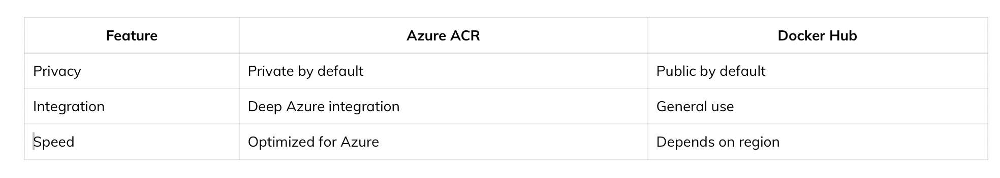
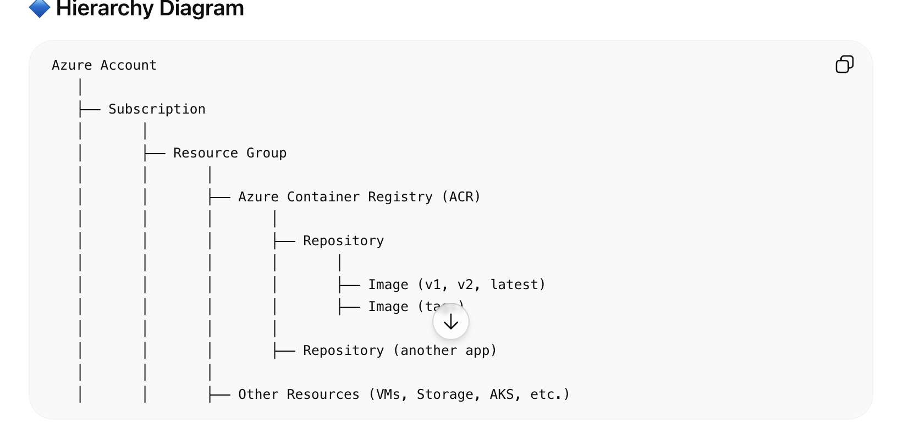
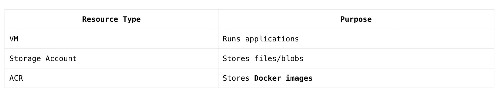
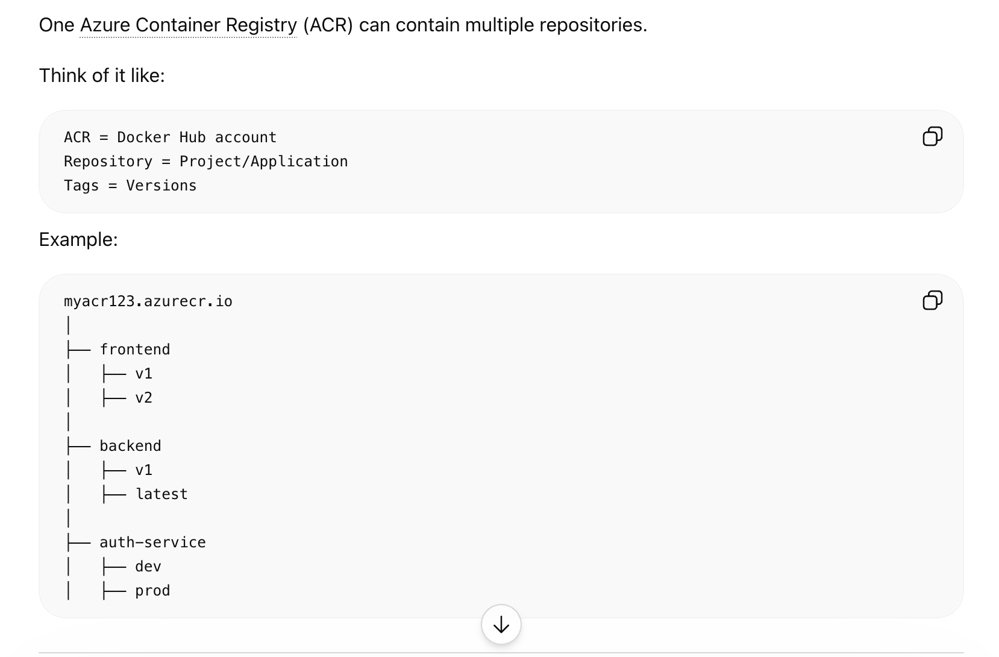

# **Azure ACR**

Azure ACR stands for Azure Container Registry in Microsoft Azure. It’s a private registry service used to store and manage container images (like Docker images).

📦 What Azure ACR actually is

Think of it like GitHub, but for container images instead of code.

You build a container image using Docker
Then push it to Azure ACR
Later, you pull it from ACR to run apps on services like Kubernetes or VMs

🧠 Why use Azure ACR?

🔒 Private & secure (unlike public Docker Hub repos)
⚡ Faster deployments (integrated with Azure services)
🔄 Versioning support (store multiple image versions)
🔗 Works seamlessly with Azure Kubernetes Service (AKS)

🏗️ Basic workflow

Build image locally:
docker build -t myapp:v1 .

Tag image for ACR:
docker tag myapp:v1 myregistry.azurecr.io/myapp:v1

Login to ACR:
az acr login --name myregistry

Push image:
docker push myregistry.azurecr.io/myapp:v1

Deploy from ACR (e.g., to AKS)

This is the part where everything comes together.
    What “Deploy from ACR to AKS” actually means
    When you deploy from ACR to AKS, you are:
    Taking a container image stored in Azure Container Registry and running it as a live application inside Azure Kubernetes Service.

 Simple analogy
ACR = storage (like a warehouse of your app images)
AKS = execution environment (like machines that run your app)
So deployment = “run this image from the warehouse on these machines.”

⚙️ How it works (behind the scenes)

You push your image to ACR

myregistry.azurecr.io/myapp:v1
AKS is configured to access ACR (permissions)
You tell Kubernetes:

“Create a container using this image”
AKS pulls the image from ACR and runs it

🧾 Key Components

Registry → Your private image storage
Repository → Group of images (like myapp)
Tag → Version (like v1, latest)

🆚 ACR vs Docker Hub

🚀 Simple ACR CLI Example

Create a registry:

az acr create --resource-group myResourceGroup \
  --name myregistry \
  --sku Basic

List registries:

az acr list --output table
💡 When should you use ACR?

Use it when:

You’re deploying apps on Azure
You need secure container storage
You’re using Kubernetes or CI/CD pipelines

📦 What exactly it is

Azure Container Registry (ACR) is a managed service offered by Microsoft Azure for storing and managing container images.

🧠 In simple terms

ACR is:

A private Docker registry in Azure
Used to store container images securely
Fully managed (you don’t maintain servers)

🏗️ Where it fits in Azure ecosystem

Build image → using Docker
Store image → in ACR
Run image → using services like:
Azure Kubernetes Service (AKS)
Virtual Machines
App Services

🚀 Example use case

You build a web app container → push to ACR → deploy it to AKS → users access your running app. 

Creating an Azure Container Registry (ACR) is straightforward. Here’s a clean step-by-step using the main methods.

🔹 Option 1: Using Azure Portal (GUI)

Go to the Microsoft Azure Portal
Click Create a resource
Search for Container Registry
Click Create

Fill in:
    Subscription: Choose yours
    Resource Group: Create new or select existing
    Registry name: Must be globally unique (e.g., myacr123)
    Region: Choose closest to you
    SKU:
    Basic (cheap, dev/test)
    Standard
    Premium (advanced features)
Click Review + Create
Click Create
Done — your ACR is ready.

## Here’s the end-to-end flow to push a simple Docker image to Azure Container Registry (ACR) in Microsoft Azure—clean and practical.

🔷 Step-by-Step: Push Docker Image to ACR

🔹 1. Prerequisites

Make sure you have:

Docker installed and running
Azure CLI installed
An existing ACR (e.g., myacr123)

🔹 2. Login to Azure

az login
🔹 3. Login to ACR

az acr login --name myacr123
This connects Docker to your registry.

🔹 4. Create a Simple Docker App

Create a file named Dockerfile:

## Simple Node app example
FROM node:18

WORKDIR /app

COPY . .

RUN npm install

CMD ["node", "app.js"]
Create app.js:

console.log("Hello from ACR!");
🔹 5. Build Docker Image

docker build -t myapp:v1 .

🔹 6. Tag Image for ACR

This step is critical:

docker tag myapp:v1 myacr123.azurecr.io/myapp:v1
Format:

<acr-name>.azurecr.io/<repo>:<tag>

🔹 7. Push Image to ACR

docker push myacr123.azurecr.io/myapp:v1
🔹 8. Verify Image in ACR

az acr repository list --name myacr123 --output table
or

az acr repository show-tags --name myacr123 --repository myapp --output table
🔷 What Just Happened

You created:

ACR: myacr123.azurecr.io
   └── Repository: myapp
         └── Image: v1so basically acr is just anouther resource in azure?

## Repository Structure

Image naming format:

<acr>.azurecr.io/<repository>:<tag>

Example:

myacr123.azurecr.io/frontend:v1
myacr123.azurecr.io/backend:v2
myacr123.azurecr.io/auth-service:latest

How repositories get created?

You usually don’t manually create repos.

When you push:

docker push myacr123.azurecr.io/frontend:v1

if frontend repo doesn’t exist, ACR creates it automatically.

List repositories
az acr repository list \
  --name myacr123 \
  --output table

Here:

frontend → repository
v1 → tag/version

## Is ACR is just anouther resource in azure?

Yes — but that description is a bit too simplified. Let’s make it precise so you don’t build the wrong mental model.

👉 In Microsoft Azure, ACR is a resource, but it’s a specialized one.

🔷 The Accurate View
✔ Azure Container Registry (ACR) =
A managed, private container image registry resource inside a resource group

So:
✅ It is a resource (like a VM, storage account, etc.)
❗ But it also acts like a service for storing and managing container images

🔹 Why It’s Not “Just Another Resource”

If you think of it as “just another resource,” you might miss its role:

ACR is closer to:
    Docker Hub (public registry)
    But private and integrated into Azure

## Using ACR with Existing Pipelines
If you already have container development and deployment pipelines set up, say with Jenkins, GitHub Actions, or Azure DevOps, you can integrate ACR as your container image storage.
Instead of pushing your built images to Docker Hub or another public registry, you’d push them to your ACR instance.
This provides privacy, security, and potentially faster access if you’re deploying within Azure.

Automated Builds with Triggers
Source Code Commit Triggers
If your source code is in a Git-based repository (like GitHub or Azure Repos), you can set up an ACR Task to automatically build a new container image every time you commit to a specific branch or even on every commit to any branch. This ensures that every change to your codebase results in a fresh container image ready for deployment.
Base Image Update Triggers
Many Docker containers are built on top of base images (like node:14 or ubuntu:20.04). When these base images get updated, it can be important to rebuild your containers to pick up those updates, especially if they're security-related. ACR Tasks can automatically detect when a base image has been updated and trigger a rebuild of your containers that depend on it.

## why we need to run docker first to do docker build?

Because docker build is not just a simple command-line operation — it needs the Docker Engine running in the background to actually create the image layers.

Think of Docker as 2 parts:

    Docker CLI  -> commands you type
    Docker Engine/Daemon -> does the real work

When you run:

docker build -t myapp .

the CLI sends the request to the Docker daemon (dockerd).

The daemon then:

    Reads Dockerfile
    Pulls base images
    Creates filesystem layers
    Runs build steps (RUN, COPY, etc.)
    Creates final image
    Stores image locally

Without Docker Engine running, the CLI has nobody to talk to.

That’s why you get errors like:

Cannot connect to the Docker daemon

