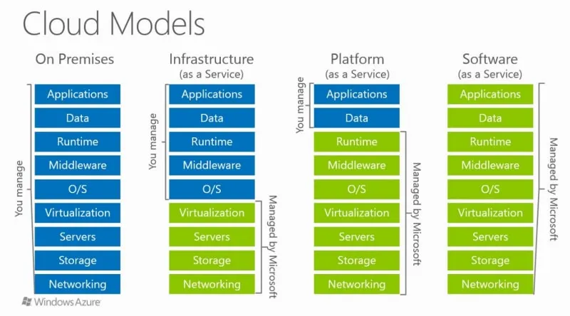
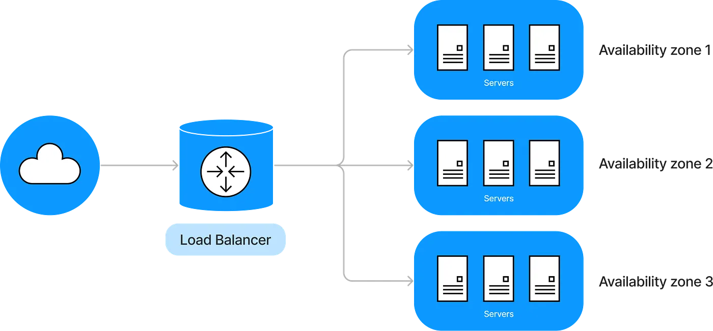
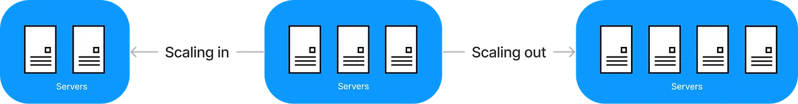
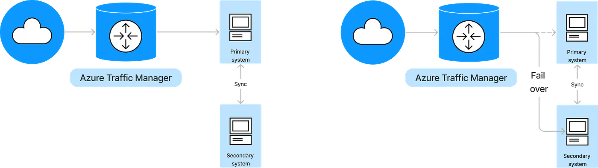
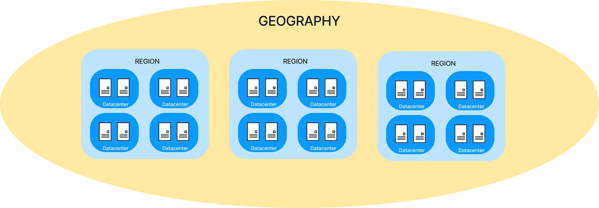
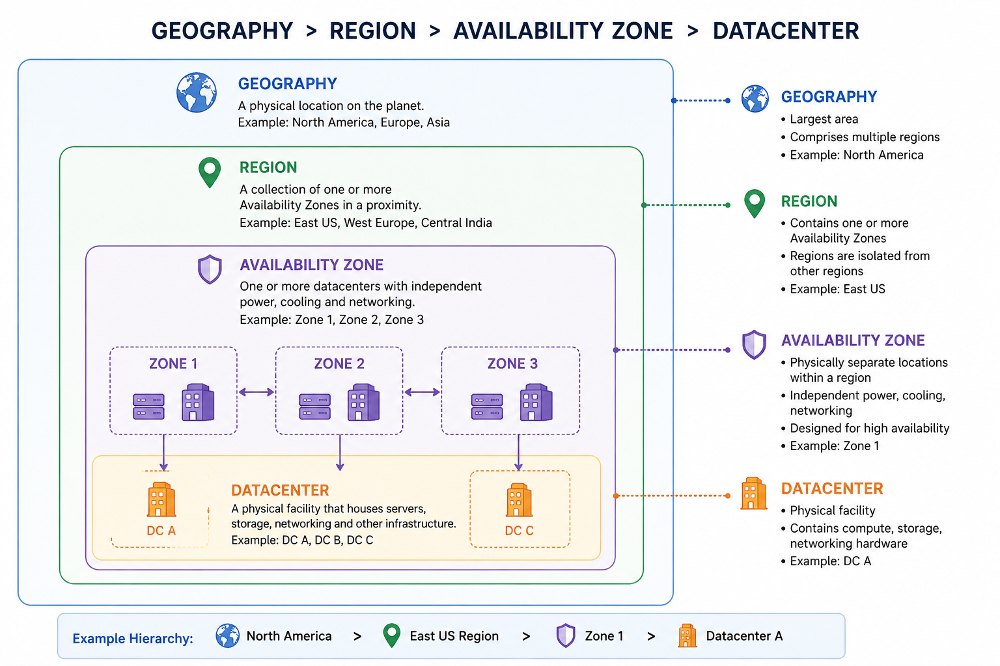
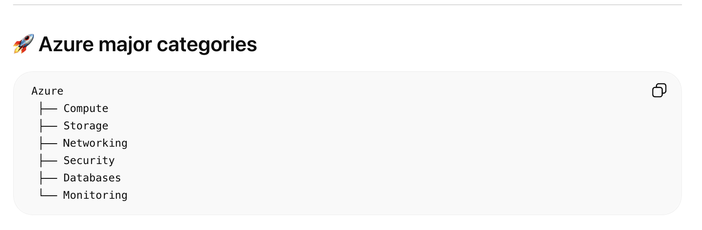
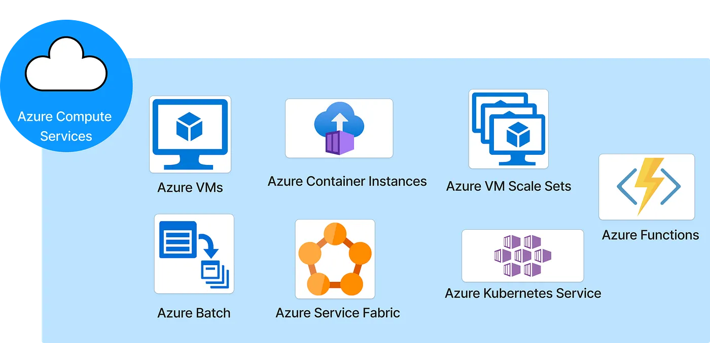
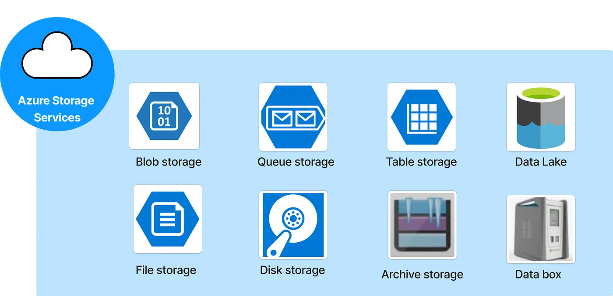

# **Azure**

## What is Azure?

https://medium.com/@arunabh223/introduction-to-microsoft-azure-8d4f1370392e

Azure is Microsoft’s cloud computing platform which provides storage, networking, computing and analytics services to its clients. Azure provides a one stop shop to its users for building and deploying applications throughout a global network of data centers.
The most important feature of Azure is the ability to scale based on computing demand. It has a Pay-As-You-Go pricing model.

## Cloud concepts
Cloud computing is the practice of using a network of remote servers hosted on the internet to manage data rather than storing it on a local server or an ‘on-premise’ system.

Cloud computing provides multiple benefits — the user pays only for what they consume, applications/services can be launched anywhere in the world, the cloud provider manages the physical security of the servers, resources are scalable i.e. can be increased or decreased on demand and the services are reliable i.e. user doesn’t have to worry about regular backups.
There are 3 different types of cloud services other— Software as a Service (SaaS), Platform as a Service (PaaS) or Infrastructure as a Service (IaaS).

## It is important for a cloud practitioner to understand the following terminology.

Availability — this means that a service remains active without any single point of failure. This is done usually by running the workload across multiple datacenters (or Availability Zones i.e. AZs). The load balancer evenly distributes traffic to multiple datacenters and reroutes traffic to a backup datacenter when one datacenter goes down.

Scalability — it is the ability to increase computing capacity based on increasing demand.
There are two types of scaling — Vertical scaling (increasing the size of the server) and Horizontal scaling (adding more server of same size).
Horizontal scaling is considered to be more practical.

Elasticity — the ability to automatically increase or decrease capacity based on the computing demand. This is usually done using Horizontal scaling.
In Azure, scaling is done using VM Scale Sets. Scale sets can scale-out (increase capacity) or scale-in (decrease capacity) based on the computing demand.

Fault tolerance — ability for a service to ensure that there is no single point of failure. This is done by planning fail-overs i.e. having a redundant system so that the primary one fails, the traffic can shift to the secondary system.
Azure Traffic Manager is a DNS-based traffic balancer which manager fail-overs.

High durability— the ability to recover from a disaster and prevent loss of data. A durable system should have regular backups and the ability to restore backups fast so that work is not disrupted.

## Azure architecture
Global infrastructure
Availability zone (AZ) — it is what Azure calls its datacenters. AZs are physically separate from each other.
Region — Grouping of multiple datacenters (AZs).
Geography — Grouping of two or more regions.

Azure global infrastructure
Azure has a feature by which it increases its ‘durability’. A region is paired with another and only one region is updated at a time to ensure ‘zero outages.’ This is called Geo Redundant Storage (GRS).

In Microsoft Azure, an Availability Zone (AZ) is a concept in cloud geography that refers to physically separate data centers within the same region.

Here’s how it fits together:

🌍 Azure Geography Structure

Azure organizes its infrastructure in layers:

Geography → Large area (e.g., Europe, Asia)
Region → Specific area within a geography (e.g., East US, West Europe)
Availability Zone (AZ) → Distinct locations inside a region
⚙️ What is an Availability Zone?

An AZ is:

A separate physical location within an Azure region
Made up of one or more data centers
Equipped with independent power, cooling, and networking
🔐 Why AZs matter

They are designed for high availability and fault tolerance:

If one zone fails (power outage, natural disaster, etc.), others continue running
You can distribute your apps across multiple AZs to avoid downtime
🧠 Example

In a region like East US, Azure may have:

Zone 1
Zone 2
Zone 3
Each zone is isolated, so your application can run safely across them.

🚀 Simple analogy

Think of a region as a city, and availability zones as different buildings in that city—far enough apart that a problem in one building won’t affect the others.

🏢 Data Center

A data center is:

A single physical facility
Contains servers, storage, networking equipment
Has its own power, cooling, and security

🌐 Availability Zone (AZ)
An Availability Zone in Microsoft Azure is:

A logical grouping of one or more data centers
Located within the same region
Designed to be isolated from other zones (separate power, networking, etc.)

## Azure core services
This is an important part of this article as it entails what services Azure provides to its users. We must first understand how Azure divides its services into different categories:

- Compute services: 
 allow you to deploy and manage workloads on Microsoft Azure

- App services
This service allows users to deploy and manage web apps on Azure.

- Network services
Virtual Network (VNet) – Private network in Azure
Azure Load Balancer – Distributes traffic across servers
Azure DNS – Domain name hosting
VPN Gateway – Secure connection between on-premises and Azure

- Storage services

- Database services
Managed databases for storing data.

Azure SQL Database – Managed SQL Server database
Azure Cosmos DB – NoSQL database (globally distributed)
Azure Database for MySQL/PostgreSQL – Open-source databases
Azure Table Storage – NoSQL key-value storage

- Analytics and Big Data

- AI and Machine Learning

## Resource Group:
A Resource Group in Microsoft Azure is a logical container used to hold and manage related resources together.

A resource group is like a folder that contains all the resources for an application, such as:

Virtual machines
Databases
Storage accounts
Networking components

- Why Resource Groups are Used

   They help you:

   Organize resources – Keep everything related to one project in one place
   Manage lifecycle – Create, update, or delete all resources together
   Control access – Apply permissions at the group level
   Monitor and track costs – See usage for a specific group

🔹 Example

Imagine you are building a web application:

You can create a resource group called “WebApp-RG” and include:

A virtual machine (backend)
Azure SQL Database
Storage account
Virtual network
Now, if you delete the resource group → all resources inside it are deleted automatically.

🔹 Key Points to Remember

A resource can belong to only one resource group at a time.
Resource groups can include resources from different regions.
They help in easy deployment and management.
A resource group in Azure is a logical container that holds related resources for an application, enabling unified management, access control, and lifecycle handling.
A resource group in Microsoft Azure can contain almost any type of Azure resource, including all the core services.

That means you can put a mix like:

Compute (VMs, App Services)
Storage (Blob, Disk, Files)
Networking (VNets, Load Balancers)
Databases (SQL, Cosmos DB)
   all inside one resource group if they belong to the same application or project.

🔹 But there are a few important nuances

Any resource type is allowed → no restriction on mixing services
Resources must belong to only one resource group at a time
Regions can differ → resources in one group don’t have to be in the same location
Lifecycle grouping matters → usually you group things that you want to manage or delete together.

🔹 Example

A single resource group could include:

A web app (compute)
A database (data)
A storage account (files/images)
A virtual network (connectivity)

🔹 Practical advice

Just because you can put everything in one group doesn’t mean you always should. A better approach is:

Group resources by application or lifecycle
Avoid putting unrelated systems in the same group
Use separate groups for dev, test, and production
🔹 Bottom line

✔️ Yes, a resource group can contain any mix of Azure core services
⚠️ But you should organize them based on how you want to manage them

Example: Web Application Project Structure

Subscription

│

├── RG-Dev (Development)

│   ├── Web App (App Service)

│   ├── Database (SQL)

│   ├── Storage Account

│   └── Virtual Network

│

├── RG-Test (Testing)

│   ├── Web App

│   ├── Database

│   ├── Storage

│   └── Networking

│

└── RG-Prod (Production)

    ├── Web App

    ├── Database

    ├── Storage

    └── Networking

Creating a Resource Group in Microsoft Azure is straightforward, and you can do it in a few different ways. The most common is through the Azure Portal.

🔷  Using Azure Portal (GUI)

Go to the Azure Portal (portal.azure.com)
In the search bar, type “Resource groups”
Click + Create

Fill in the details:

Subscription – Choose your subscription
Resource Group Name – e.g., MyApp-RG
Region – Choose a location (e.g., Central India)
Click Review + Create
Click Create
✅ Your resource group is now ready

## Subscription
In Microsoft Azure, a subscription is basically your billing and management boundary for using Azure services.

🔷 Simple Definition

An Azure subscription is a plan/account that gives you access to Azure services and tracks how much you use (and pay).

🔷 Easy Analogy

Think of it like a mobile SIM plan:

The subscription = your mobile plan
The services (VMs, storage, etc.) = apps you use
The bill = based on usage
🔷 What a Subscription Does

A subscription helps you:

💰 Track billing – All usage is charged to a subscription
🔐 Control access – Who can use resources
📊 Manage resources – Resource groups exist inside a subscription
📉 Monitor usage – See how much you’re consuming
🔷 Structure in Azure

                                 Azure Account
                                    ↓
                                 Subscription
                                    ↓
                                 Resource Group
                                    ↓
                                 Resources (VMs, DB, Storage, etc.)
                                 🔷 Types of Subscriptions

Free Trial – Limited credits for beginners
Pay-As-You-Go – Pay for what you use
Enterprise Agreement – For large organizations
Student Subscription – Free credits for students
🔷 Key Points

A subscription is required to create any resource
You can have multiple subscriptions under one account
Each subscription has its own billing and limits
Resource groups belong to one subscription only
To see your subscriptions in Microsoft Azure, you can use the Azure Portal. Here’s how:

🔷 Using Azure Portal (Easiest)

Go to portal.azure.com and sign in
In the top search bar, type “Subscriptions”
Click on Subscriptions from the results
👉 You’ll now see a list of all subscriptions linked to your account:

Subscription name
Subscription ID
Status (Active/Disabled)
Azure Hierarchy Diagram
Azure Account (User / Organization)
│
├── Subscription A (Billing + Access Boundary)
│   │
│   ├── Resource Group 1 (App1-Dev)
│   │   ├── Virtual Machine (Compute)
│   │   ├── Storage Account (Storage)
│   │   └── Virtual Network (Networking)
│   │
│   ├── Resource Group 2 (App1-Prod)
│   │   ├── App Service (Compute)
│   │   ├── SQL Database (Database)
│   │   └── Load Balancer (Networking)
│   │
│   └── Resource Group 3 (Shared Services)
│       ├── Azure Active Directory
│       └── Monitoring Tools
│
└── Subscription B
    │
    └── Resource Group (Test)
        ├── VM
        ├── Storage
        └── Database

👉 Azure hierarchy flows as:
Account → Subscription → Resource Group → Resources

🔑 Key Relationships

One account → can have multiple subscriptions
One subscription → can have multiple resource groups
One resource group → can have multiple resources
Each resource belongs to only one resource group

## Azure Commands:
Here are the most useful basic Azure CLI commands to get you started with Microsoft Azure. These cover login, resource management, and common tasks.

🔐 Login & Account

az login
Opens a browser to sign in.

az account show
Displays current account info.

az account list
Lists all subscriptions.

az account set --subscription "SUBSCRIPTION_NAME"
Switch to a specific subscription.

📁 Resource Groups (container for resources)

az group create --name myResourceGroup --location centralindia
az group list
az group delete --name myResourceGroup