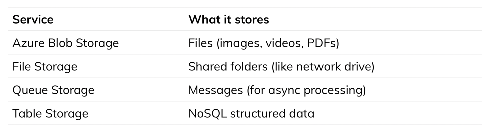

# **Azure Storage account**

An Azure Storage Account is a foundational management container that provides a unique, globally accessible namespace for storing Azure data objects, including blobs, files, queues, and tables. It serves as a single, secure, and durable endpoint for managing data, enabling security, replication, and data analytics capabilities across cloud services. 

In Azure Storage Account:
Storage Account = container for all storage services
Inside it, you can have:

Blob Storage (files, images, videos)
File Storage
Queue Storage
Table Storage

## 📦 What is Blob Storage?
In Azure Blob Storage:

Blob Storage = place to store unstructured data
👉 Examples:

images
PDFs
videos
logs
backups
🧩 Structure (very important)

Storage Account
   ↓
Container
   ↓
Blob (file)

Example

myhealthappstorage
   ↓
reports
   ↓
report1.pdf
image1.png
🧠 Real-world analogy

Storage Account = Hard drive
Container = Folder
Blob = File

## 🚀 Step-by-step (how to create)

1. Create Storage Account

In Azure Portal:

Go to Storage Accounts
Click Create
Fill basics:

Subscription
Resource Group
Name (must be unique)
Region

2. Create Container

Inside Storage Account:

Go to Data storage → Containers
Click + Container
Example:
health-reports

3. Upload Blob

Open container
Click Upload
Select file 

🌐 How you access a blob

URL looks like:

https://<storage-account>.blob.core.windows.net/<container>/<file>
🧠 Example

https://healthappstorage.blob.core.windows.net/reports/report1.pdf
⚡ Why this matters for your app

For your health app:
store reports (PDFs)
store user uploads
store images

👉 Backend will:

upload to blob
store URL in DB

👉 Blob Storage is a service of Azure, and it lives inside a Storage Account

🧩 How it fits in Azure

In Microsoft Azure:

Azure
  ↓
Storage Account (service container)
  ↓
Blob Storage (one of the services)

🧠 Important clarification

👉 “Storage Services” is a category in Azure
👉 “Storage Account” is the actual resource you create
👉 Blob Storage is a feature inside that resource

Azure
  ↓
Storage Services (category)
  ↓
Storage Account (resource you create)
  ↓
Blob / File / Queue / Table (features inside)

Blob Storage is a core storage service of Azure, available inside a Storage Account.

👉 Blob Storage is NOT a separate resource in Azure
👉 Storage Account is the resource

🧩 How it actually works

In Microsoft Azure:

Resource you create → Storage Account
Feature inside it   → Blob Storage

## 🧠 What is a SAS Token?

👉 SAS (Shared Access Signature) is a temporary, secure URL that gives limited access to your storage.

In Azure Blob Storage:

SAS = permission + time limit + resource

🔍 Simple definition

A SAS token allows someone to access a blob without exposing your storage account keys.

🧩 Example
Normal blob URL:

https://healthappstorage.blob.core.windows.net/reports/file.pdf
👉 If private → ❌ not accessible

With SAS token:
https://healthappstorage.blob.core.windows.net/reports/file.pdf?sv=...&sp=...&se=...
👉 Now accessible ✅

🧠 What SAS contains
A SAS token defines:

Property	Meaning
sp	permissions (read/write)
se	expiry time
sr	resource (blob/container)
signature	security hash

🔐 Why SAS is used
Without SAS:

You must share storage keys ❌ (very unsafe)
With SAS:
You give limited access ✅

🚀 Real use case (your app)

Frontend → Backend
         ↓
Backend generates SAS
         ↓
Frontend uploads directly to Blob
👉 Benefits:

secure
scalable
no backend load

⚡ Types of access

Read-only SAS
User can download file

Write SAS
User can upload file

Full access (careful)
Read + Write + Delete

🧠 Real-world analogy

SAS = temporary OTP link to access file
expires after time
limited permissions

🔥 Example scenario (your survey fallback)

Backend fails API
   ↓
Uploads JSON to Blob
   ↓
Generates SAS
   ↓
Stores link in DB

🧠 One-line takeaway
SAS token is a secure, temporary way to grant limited access to your Blob Storage without exposing keys.

🧠 What is a SAS Token?

👉 SAS (Shared Access Signature) is a temporary, secure URL that gives limited access to your storage.

In Azure Blob Storage:

SAS = permission + time limit + resource

🔍 Simple definition

A SAS token allows someone to access a blob without exposing your storage account keys.

🧩 Example

Normal blob URL:

https://healthappstorage.blob.core.windows.net/reports/file.pdf
👉 If private → ❌ not accessible

With SAS token:

https://healthappstorage.blob.core.windows.net/reports/file.pdf?sv=...&sp=...&se=...
👉 Now accessible ✅

🧠 What SAS contains

A SAS token defines:

Property	Meaning
sp	permissions (read/write)
se	expiry time
sr	resource (blob/container)
signature	security hash

🔐 Why SAS is used

Without SAS:

You must share storage keys ❌ (very unsafe)
With SAS:

You give limited access ✅

🚀 Real use case (your app)

Frontend → Backend
         ↓
Backend generates SAS
         ↓
Frontend uploads directly to Blob
👉 Benefits:

secure
scalable
no backend load

⚡ Types of access

Read-only SAS

User can download file

Write SAS

User can upload file

Full access (careful)

Read + Write + Delete

The SAS token is generated by using Azure credentials and then sent to the frontend for secure, temporary access.

const accountName = "healthappstorageaver132";
const accountKey = "<your-key>”;

new StorageSharedKeyCredential(accountName, accountKey)

### 🔐 Where to get Account Key
Inside your Azure Storage Account:

Steps:

Open your storage account
In left sidebar → click:
Security + networking → Access keys

🔥 Pro tip
You can regenerate keys anytime:
Access keys → Regenerate
👉 Useful if key leaked

Account name is your storage account name, and account key is found under “Access keys” inside that storage account.

🧩 Where container is defined

In Azure Blob Storage:

Storage Account
   ↓
Container  ← YOU CHOOSE THIS
   ↓
Blob (file)
const containerName = "health-reports";
const blobName = `uploads/${Date.now()}-file.pdf`;

https://healthappstorageaver132.blob.core.windows.net/health-reports/reports/2026/may/report1.pdf?sv=...&sp=rw

### Blob doesn’t follows folder structure.

🧠 Reality of Blob Storage

In Azure Blob Storage:

There are NO real folders
👉 Everything is stored in a flat structure

📦 Then why do we see folders?

Because Azure uses virtual folders based on naming

Example

You upload a blob with name:

reports/2026/may/file.pdf
👉 Azure UI shows:

reports
  └── 2026
       └── may
            └── file.pdf
But internally:

It’s just ONE blob with full name:
"reports/2026/may/file.pdf"
🧠 Key concept

Folder = part of blob name (string), not real directory
In Azure Blob Storage:

You DON'T "query" blobs like SQL
👉 Instead you:

list blobs
filter by prefix (path)
optionally use tags / metadata
🧩 1. Most common: List by prefix (like folder)

Since folders are virtual:

survey-failures/user123/2026-05-06.json
👉 You “query” like this:

✅ CLI example

az storage blob list \
  --account-name healthappstorageaver132 \
  --container-name health-reports \
  --prefix "survey-failures/user123/" \
  --auth-mode login \
  --output table
👉 This returns all blobs under that “folder”

🧠 Think of it like

prefix = WHERE path LIKE 'survey-failures/user123/%'
🧩 2. Query by exact blob name

If you know full path:

az storage blob show \
  --account-name healthappstorageaver132 \
  --container-name health-reports \
  --name "survey-failures/user123/file.json" \
  --auth-mode login

The final blob upload url is constructed as:

htps://{account}.blob.core.windows.net{accountKey}/{containerName}/{folder}/{fileName}.csv
In Out project:

account - pccintakestononprod
container - dynamic-forms
folderName - "exception-order-medical-history-{$date & $time}
fileNme - consist of user name, ob/non-ob, refill type, date & time