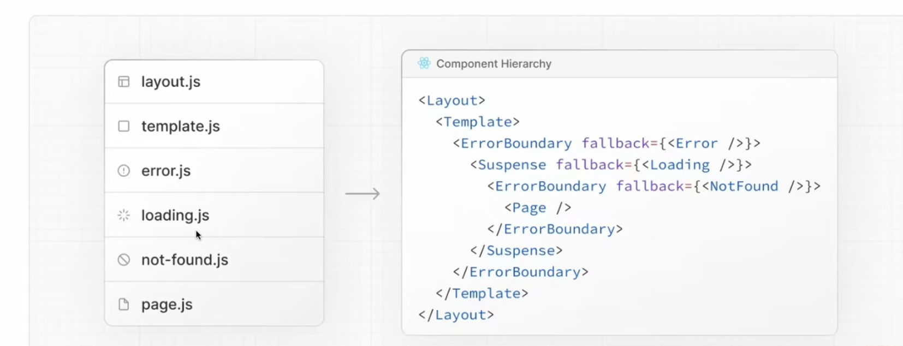

# **NextJs Router**

App Router in Next.js is the NEW routing system introduced in Next.js 13+ 🔥
It is based on:
app/

folder instead of:
pages/

🚀 Old vs New
Pages Router	App Router
pages/	        app/
older system	newer modern system
getServerSideProps	async server components
simpler	        more powerful

🚀 Pages Router
pages/
   index.js
   about.js

🚀 App Router
app/
   page.js
   about/
      page.js

🧠 Important Difference
In App Router:
folders define routes

and inside folder:
page.js
represents page.

🚀 Example
app/
   dashboard/
      page.js

creates route:
/dashboard

🔥 Biggest Change
Components are SERVER COMPONENTS by default
This is HUGE.

🧠 Meaning
By default:
rendered on server
can fetch data directly
no browser JS needed initially

🚀 Example
async function getUsers() {
  const res = await fetch(
    "https://jsonplaceholder.typicode.com/users"
  )
  return res.json()
}

export default async function Page() {
  const users = await getUsers()
  return (
    

      {users.map(user => (
        
{user.name}

      ))}
    

  )
}

⚡ Notice
No:
getServerSideProps()

No:
useEffect()

🔥 Why?
Because App Router supports:
async server components
directly.

## 🚀 Client Components
If component needs:

useState
useEffect
browser APIs

must add:
"use client"
at top.

Example
"use client"

import { useState } from "react"

export default function Counter() {
  const [count, setCount] = useState(0)

  return (
    <button onClick={() => setCount(count + 1)}>
      {count}
    </button>
  )
}

**🧠 Without "use client"**
Hooks won’t work.
Because component is server component by default.

🚀 Special Files in App Router
File	    Purpose
page.js	    route page
layout.js	shared layout
loading.js	loading UI
error.js	error handling
not-found.js	404 UI

🔥 Layout Example
app/
   layout.js
   dashboard/
      page.js

layout.js
wraps pages automatically.

Great for:
navbar
sidebar
common UI

🚀 Nested Layouts
One of App Router’s BEST features.

Each folder can have:
its own layout
🚀 Dynamic Routes

Same concept:
app/posts/[id]/page.js
Access Params
export default function Page({ params }) {
  return <h1>{params.id}</h1>
}

🚀 Data Fetching
Huge simplification.

No more:
getServerSideProps
getStaticProps

Mostly just:
async components + fetch()

🔥 App Router Features
Feature	            Benefit
Server Components	less JS
Streaming	        faster UX
Nested Layouts	    powerful UI
Colocation	        cleaner structure
Suspense	        better loading states

⚠️ But App Router is more complex initially

Because:
server/client boundary
caching behavior
async rendering
React Server Components

can feel confusing initially.

## 🚀 Server Components vs Client Components

By default in App Router:
everything is server component

Server components CANNOT use:
onClick
useState
useEffect

because they run on server.

❌ This WON’T work
export default function Page() {
  return (
    <button onClick={() => alert("Hi")}>
      Click
    </button>
  )
}

Why?
Because:
onClick needs browser JavaScript
but server component runs on server only.

🔥 Solution
Add:
"use client"
at top.

✅ Correct
"use client"

export default function Page() {
  function handleClick() {
    alert("Hi")
  }
  return (
    <button onClick={handleClick}>
      Click
    </button>
  )
}

🧠 What "use client" means
It tells Next.js:

this component should run in browser/client.

🚀 Client Components Needed For
Feature	Needs "use client"?
onClick	✅
useState	✅
useEffect	✅
browser APIs	✅

🚀 Server Components Good For
Use Case
data fetching
database calls
rendering static UI
secure backend logic

### 🔥 Common Real-world Pattern
Server page
import Counter from "./Counter"

export default async function Page() {
  const data = await fetchData()

  return (
    

      <h1>Dashboard</h1>

      <Counter />
    

  )
}

Counter Component
"use client"

import { useState } from "react"

export default function Counter() {
  const [count, setCount] = useState(0)

  return (
    <button onClick={() => setCount(count + 1)}>
      {count}
    </button>
  )
}

**🧠 This is IMPORTANT Architecture**
App Router encourages:
Server Components for data
+
Client Components for interactivity

## Using Action in App Router
🚀 Server Actions
In App Router you can directly call server functions from forms.
Without creating separate API routes sometimes.

Example
async function saveData(formData) {
  "use server"
  console.log(formData.get("name"))
}

Use in form
<form action={saveData}>
  <input name="name" />

  <button type="submit">
    Save
  </button>
</form>

🧠 What happens?
When button clicked:

Browser
   ↓
Next.js calls server action
   ↓
Function runs on server
🔥 "use server"

Marks function as:
server-side function

🚀 Why powerful?
Old way:

Button
 ↓
fetch("/api/save")
 ↓
API Route
 ↓
Server
App Router Server Action
Form
 ↓
Server function directly

Much cleaner.
🚀 Example with DB Save
async function addWorkout(formData) {
  "use server"

  const name = formData.get("name")
  await db.workouts.create({
    name
  })
}

Usage
<form action={addWorkout}>
  <input name="name" />

  <button type="submit">
    Add Workout
  </button>
</form>

⚡ But onClick still needs client component
Example:
"use client"

needed for:
button click handlers
state
interactivity

🧠 Quick Difference
Feature	    Purpose
onClick	    client/browser interaction
action={fn}	server form submission

⚡ Why client component needed?
Because browser handles:
form interactions
clicks
typing
UI updates

⚡ Why server action needed?
Because:
DB access
secure logic
mutations
secrets

should run on server.

💬 Ultimate simplified understanding
"use client"
component runs in browser

"use server"
function runs on server

Server Components CAN render Client Components

This is the key thing confusing you initially 🔥

🚀 Example
import Form from "./Form"

async function saveData(formData) {
  "use server"

  console.log(formData.get("name"))
}

export default function Page() {
  return <Form action={saveData} />
}

Client Component
"use client"

export default function Form({ action }) {
  return (
    <form action={action}>
      <input name="name" />

      <button type="submit">
        Save
      </button>
    </form>
  )
}

🧠 What is happening here?
Page Component
(server component)

Contains:
"use server"
function.

Form Component
(client component)
Contains:
"use client"

because:
form interactivity
browser behavior
hooks maybe

## Structure

## Loading and Error
Using special files:

File	    Purpose
loading.js	loading UI
error.js	error UI

🚀 loading.js

Shows automatically while page/data is loading.

Example Structure
app/
   dashboard/
      page.js
      loading.js

loading.js
export default function Loading() {
  return <h1>Loading...</h1>
}

page.js
async function getData() {
  await new Promise((res) =>
    setTimeout(res, 3000)
  )

  return ["Workout 1", "Workout 2"]
}

export default async function Page() {
  const data = await getData()

  return (
    

      {data.map((item) => (
        
{item}

      ))}
    

  )
}
🧠 What happens?

During:
await getData()

Next.js automatically shows:

loading.js
🔥 No manual loading state needed

No:
useState()
isLoading

for server components.
🚀 error.js

Handles runtime errors automatically.

Structure
app/
   dashboard/
      error.js
Example
"use client"

export default function Error({
  error,
  reset
}) {
  return (
    

      <h1>Something went wrong</h1>

      <button onClick={() => reset()}>
        Retry
      </button>
    

  )
}

⚠️ Important
error.js MUST be:
"use client"
because:

uses button click
interactivity
reset function

🚀 Example Error
async function getData() {
  throw new Error("Failed")
}

Then:
error.js automatically appears

🚀 Why App Router loading is powerful

Supports:

streaming
partial rendering
suspense
nested loading states

Very modern React architecture.

