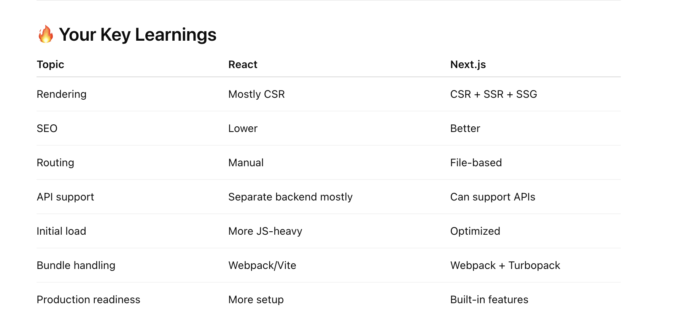

# **Basics**

React JS app after compilation turns into a bundle, which is heavy to load on browsers.

⚡ What browser receives initially
Usually something like:

👉 Very little actual content.

Then browser:
Downloads JS bundle
Executes React
React builds UI in browser

This is called:
👉 Client Side Rendering (CSR)

🚨 Problem
If bundle becomes huge:

initial load slower
blank screen longer
SEO weaker

Especially on:
slow internet
mobile devices

🧠 Example
Suppose your app has:

charts
dashboards
libraries
huge dependencies

Then:
bundle.js → very large

Browser must:
download
parse
execute

👉 This takes time.

After initial load, all useeffects will execute and make API calls and once received response with re render component.
And after that user can interact with website.
It is bad for SEO and user experience.

🧠 Traditional React CSR Flow
Step 1 — Browser gets HTML
Usually:

Very little UI initially.

Step 2 — JS Bundle Downloads

Browser downloads:
React
your components
libraries
app code

Step 3 — React Executes
React starts rendering components.

Step 4 — Initial Render Happens
At this point:
JSX rendered
basic UI appears

BUT:
👉 Data may still be empty.

Example:
Loading...

Step 5 — useEffect() Runs
YES ✅

After component mounts:
useEffect executes
API calls happen

Example:
useEffect(() => {
  fetchUsers();
}, []);

Step 6 — API Response Returns
Data comes from backend.

Step 7 — State Updates
Example:
setUsers(data);

Step 8 — Re-render Happens
React re-renders component with actual data.

Step 9 — Full Interaction Ready
User can now:

click
search
navigate
interact fully

🚨 Why this became problematic sometimes
Imagine:

huge JS bundle
many useEffects
multiple API calls

Then:
Blank screen
↓
Loading...
↓
Finally usable

👉 Poor UX sometimes.

## Next JS Can solve these Probleam. It use React only internally.

Next js can make api calls and create html css files during build only, while react js only creates js bundle while loading bundle on browser/client site & it will call apis and all.

### 👉 Next.js does NOT always create HTML during build only.
It supports MULTIPLE rendering strategies.

Let’s cleanly separate this 👇

🧠 Traditional React (CRA/Vite style)
Build output mostly:
HTML + CSS + JS bundle

But:
👉 HTML is mostly empty shell.

Example:

⚡ What happens in browser

Browser:
Downloads JS bundle
React runs
API calls happen (useEffect)
UI updates

👉 Rendering mostly happens on CLIENT side.

This is:
✅ Client Side Rendering (CSR)

🚀 Next.js is DIFFERENT

Next.js supports MANY strategies:

Strategy	When API runs
CSR	        Browser
SSR	        Server request time
SSG	        Build time
ISR	        Revalidate periodically

🥇 1. SSG (Static Site Generation)
YES — this is what you described

During build:
API call
↓
Generate HTML
↓
Store static files

Then browser gets ready HTML instantly.

Perfect for:
blogs
docs
marketing pages

🥈 2. SSR (Server Side Rendering)

NOT during build.
Instead:
👉 On EVERY request:

User requests page
↓
Server fetches API
↓
Server creates HTML
↓
Sends to browser

Perfect for:
dashboards
personalized pages

🥉 3. CSR inside Next.js
Next.js can ALSO behave like React.

Example:
useEffect(() => {
 fetchData();
}, []);

Then API runs in browser.

🧠 BIG realization

Next.js is powerful because:
👉 You can choose WHERE rendering happens.

🔥 React vs Next.js Simplified
React:

Mostly:
Browser renders app

Next.js:
Can choose:
Build time
OR
Server
OR
Browser

That flexibility is the big win 🔥
⚡ Modern Next.js (App Router)

Even more advanced now:

Server Components
Streaming
Partial rendering

Meaning:
👉 Less JS sent to browser.

🧠 Architect-level understanding
The real question is:
“Where should rendering happen?”

Depending on:

SEO
performance
personalization
server cost
UX

💡 Example for YOUR health app
Public landing page
Use:
👉 SSG

User dashboard
Use:
👉 SSR or CSR

Because data is user-specific.

🔥 Final correction to your statement
❌ Not fully correct:

“Next.js creates HTML during build only”

✅ Correct:
“Next.js can create HTML at build time, request time, or client side depending on rendering strategy.”

## React JS SEO score is very low but Next js SEO is better.
👉 Next.js has MUCH better SEO support than plain React apps.

But let’s understand why, because that’s the important part 👇

🧠 Why SEO is weaker in traditional React CSR

In classic React apps:
Browser initially receives:

Very little actual content.
Then:

JS downloads
React runs
API calls happen
Content appears later

🚨 Problem for search engines

Search engines prefer:
👉 Ready HTML content

But React CSR initially gives:
👉 Mostly empty shell

So crawler may see:
little content
delayed rendering

Result:
❌ Worse SEO sometimes

🚀 Why Next.js SEO is better
Next.js can send:
<h1>Health Tracker</h1>

Track workouts and diet

DIRECTLY from server/build.

So search engine instantly sees:
headings
text
metadata
structured content

👉 Much better for SEO.

🔥 Core difference
React CSR
Browser builds page AFTER JS executes
Next.js SSR/SSG
Server/build generates page BEFORE browser receives it

⚡ Why this matters

Search engines like:
Google
Bing

can crawl:
HTML
metadata
content

more reliably and faster.

🥇 Next.js SEO advantages
✅ Server-rendered HTML

Huge benefit.

✅ Meta tags support
Easy dynamic:

title
description
OpenGraph

✅ Faster first paint
Better UX = better SEO ranking indirectly.

## Other benifits:
🥈 File-Based Routing

In React:
react-router setup manually

In Next.js:
app/dashboard/page.tsx

Automatically becomes:
/dashboard

Much cleaner.
🥉 API Routes

You can create backend-like APIs inside Next.js.

Example:
app/api/users/route.ts

🟡 Better Performance

Next.js gives:
code splitting
image optimization
caching
streaming

Automatically.

☁️ Full Stack Capability
Now frontend + backend can live together.
Perfect for:

modern web apps
dashboards
SaaS apps

### React uses webpack to bundle while next js uses rust to bundle?

Statement is MOSTLY correct, but let’s refine it properly 👇

🧠 Traditional React Build System
Most React apps historically used:

👉 Webpack

Especially:
Create React App (CRA)

Webpack:
bundles JS
bundles CSS
optimizes assets

🚨 Problem with Webpack

Webpack is powerful BUT:
slower for huge apps
config heavy
JS-based tooling slower sometimes

Especially during:
dev startup
hot reload
large builds

🚀 Modern Shift Happened
Industry started moving toward:

Rust-based tooling
Go-based tooling
native-speed bundlers

Because:
👉 JavaScript tooling became slow at scale.

🔥 Next.js Evolution
Historically:
👉 Next.js ALSO used Webpack.

VERY IMPORTANT:
Next.js did NOT start with Rust.

⚡ Now modern Next.js uses:
🥇 Turbopack
Built by Vercel.
Written in:
👉 Rust 🦀

Goal:
much faster dev builds
faster refresh
incremental compilation

Next.js today:
Feature	            Tool
Production builds	Mostly Webpack still (stable)
Dev mode (new)	    Turbopack
Future direction	More Rust tooling

Conslusion

                ┌───────────────────────┐
                │      React App        │
                └───────────────────────┘

Browser Request
       ↓
Gets mostly empty HTML
       ↓

       ↓
Download large JS bundle
       ↓
React executes in browser
       ↓
useEffect() API calls happen
       ↓
Data comes from backend
       ↓
Component re-renders
       ↓
Finally full UI becomes ready

❌ Slower initial load sometimes
❌ SEO weaker
❌ Browser does most rendering work
❌ More client-side JS

═══════════════════════════════════════════════════

                ┌───────────────────────┐
                │      Next.js App      │
                └───────────────────────┘

Browser Request
       ↓
Server/Build can pre-render HTML
       ↓
Ready HTML sent immediately
       ↓
<h1>Dashboard</h1>
       ↓
Browser shows UI quickly
       ↓
React hydration adds interactivity
       ↓
Smaller client-side work
       ↓
API calls if needed

✅ Better SEO
✅ Faster first load
✅ SSR / SSG support
✅ Better performance optimizations
✅ File-based routing
✅ Full-stack capabilities
✅ Better production architecture

🧠 Architect-Level Realization

Industry moved toward Next.js because modern apps needed:

performance
SEO
better UX
server rendering
scalable frontend architecture

while still using React underneath 🔥